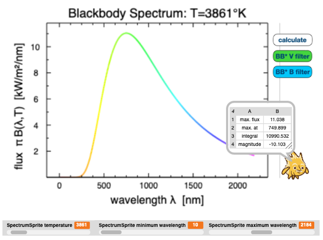

#  Example: Blackbody Explorer

This finished project lets you explore the spectrum of a "blackbody" - a perfectly emitting hot surface characterized only by it's temperature.
- See how the peak of the emission shifts with temperature.
- See how the total amount of emission shifts with temperature.

You can apply the spectral band-passes on the spectrum to mimic observing the spectrum through a standard astronomical filter, either "B" (for "blue") or "V" (for "visual", i.e. "green"). When you then measure the brightness not in physical but in astronomical units - "magnitudes" - you can reconstruct how astronomers use the "colours" of objects as a measure of their temperature.

Author: F.V. Hessman
