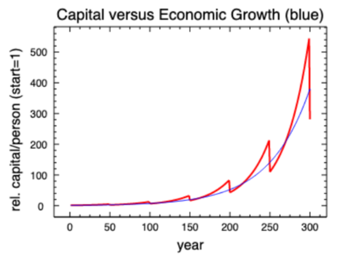
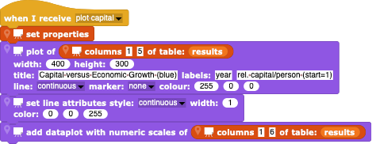

#  Example: Capital Accumulation

In this example, we'll see how to create an economic model for the evolution of capital in a business dynasty like the Rockefellers or the Krupps.

## Introduction

Capitalist economies are particularly complex, given that there are so many parties and processes involved: businesses of various sizes and influences, consumers, production fluctuations due to natural and political climate changes, the effects of technical innovation, tax rates and tax evation strategies, ...  Nevertheless, economists must try to model how economies work in order to understand what effects investment strategies, law-making, and tax and duty rates have.  Since there are no fundamental "laws" of economics like there are in physics, just assumptions and empirical estimates of consumer and investor behaviour, simple models only give a crude estimate of what is going on; there is considerable danger of creating models that conform to what one **wants** to happen (a famous historical example is the mistaken belief that tax rates have an immediate effect upon productivity).  Without economical models, it is very difficult for a society to plan for the future.

Here, we will construct a very simple model for a family business started by one person with one unit of capital: money, rental real-estate, factories, stores, hotels, restaurants, container ships, farmland, ... whatever yields a return on the capital in the family business.  *The fundamental question our simulation will attempt to answer is whether the family business grows at a rate smaller, the same, or faster than the growth rate of the underlying economy.  If smaller, the family business will shrivel up and disappear on the long-term; if much faster, the business will develop into a powerful dynasty like the Rockefellers and Krupps.*

We will assume
- the business can grow, e.g. by accruing interest on money, buying more rental apartments, building more or better factories, stores, hotels, restaurants, or container ships, buying more farmland, etc., if there is enough additional capital;
- all relevant economic parameters like tax-rates, the relative amount of consumption (how much of the family income/capital is spent on the family's lifestyle - the richer the family gets, the more the family spends on itself) and - importantly -  the rate-of-growth of the underlying economy are constant over many generations;
- every generation has the same number of children that eventually take over the family business; and
- there are no external influences like recessions, depressions, pandemias, and natural catastrophes.

With this model in mind, there are just a few parameters/quantities to consider.
- A model is run for every business **year**.
- The family has a total amount of **capital** at any time.  To make things easier, we won't use actual monetary values like $$ or Euros but some unitless relative amount so that the family starts with one unit of capital.
- There is some constant **yearly return on capital** produced by the family's economic activities.
- There is some constant **yearly rate of depreciation** needed to maintain the business: factories and stores have to be maintenanced and renovated in order to maintain even a constant amount of economic activity.  This means that, on the long term, the amount of capital can go down if the income is not able to support the activity. Usually, [*depreciation*]() is used as a micro-economic rate corresponding to the time it takes for some part of the capital to become useless - e.g. a machine or computer that must be replaced (every 5-10 years) or overhauled (the depreciation rate for residential real estate in the USA is 1/27.5 years for tax purposes).  Here, all of such things are summed up as a fraction of the capital which effectively disappears every year and so must be replaced.  To be realistic, one should consider *actual depreciation* rather than just *tax-based depreciation*, since the tax rates may or may not reflect the actual loss of capital, but tax depreciation rates are much simpler to find.
- The **yearly rate of capital consumption** and **yearly rate of income consumption** are constant (the family maintains a lifestyle that is proportional to it's wealth).
- The tax rates are constant.  These include **income tax** - perhaps reduced by a "write-off" due to the **yearly rate of depreciation** - and **estate tax** (actually both the *estate tax* paid by the deceased plus the *inheritance tax*) paid when one generation dies off, handing the family business to the next generation.
- Each generation has a constant **number of children** per co-owner of the family capital.  This number is a whole number if the succeeding generations all actively participate in the family business but could be a fractional number if only a few are active and the rest are simply "paid off" from the inheritance.
- The **lifetime** of a generation is a constant number of years.

Depending upon the business and the country, these parameters can be different: every nation has it's own tax laws and amount of business activity.  Fortunately, the differences are of little interest here, since we want to make a simple model.
- Historically, the average **yearly rate of return on capital** for all types of businesses is about 6% ([Picketty, 2013, "Capital in the 21st Century"](http://piketty.pse.ens.fr/files/capital21c/en/Piketty2014IntroChap1.pdf)), but the rate for any particular type of business can be much smaller or larger.
- The actual **yearly rate of depreciation** depends upon the business.  Farmland doesn't simply go away with time, so the cost of maintaining that capital will be very small (e.g. fertilizer), whereas machines that suffer rapid wear and tear must be replaced quickly.   Table 1 contains a few typical **yearly rates of depreciation**.
- The **rates of consumption** are the things the family has the most control over: they can be very spartan or live lavish lives.
- Rates of **income tax** vary by income, nationality, and time (see [Wikipedia](https://en.wikipedia.org/wiki/List_of_countries_by_tax_rates)).  The highest income tax rate in the USA is currently 37% (federal only) but in western countries the highest rate is typically 40-50%.  The *progression* (the way the tax rate changes with income) is also very different and complicated, so we'll simply ignore this and assume that our successful family business pays the highest nominal rate.
- **Estate tax** (plus *inheritance tax*) rates also vary widely, ranging from 0 to about 50%.  Often, there are large family exclusions that result in a very small tax rate despite a nominally large rate.
- **economic growth rates** are typically smaller for mature economies (e.g. USA, Canada and Europe) and large for young expanding ones (e.g. China, Viet Nam).  The 100-year-average rate in Western economies is about 2% (see [Wikipedia](https://en.wikipedia.org/wiki/Economic_growth)).
- The **number of owners** is assumed to be one at first; when each generation dies off and hands the family business to the next generation, that number goes up by the **number of children** per owner.

Table 1 : Examples of possible **yearly rates of depreciation**
| Type of capital | Depreciation timescale | Yearly Rate of Depreciation |
| --------------- | ---------------------- | --------------------------- |
| computers | 5 years | 0.2 |
| automobiles | 10-20 years | 0.05-0.1 |
| residential real-estate | >30 years | < 0.033 |
| farmland | >100 years | < 0.01 |

---

## The Simulation

Start by creating (global) variables for all of the relevant quantities outlined above and giving the ones that remain constant their initial values.  Later, you can vary these constants and see what effect they have upon your model.

For each year of the simulation (use, e.g. a "repeat" block),change the **year** by +1 (using the "change ... by ..." block).  Then, calculate the income effects:
- calculate the yearly **income** by multiplying the present **capital** by the **yearly return on capital**;
- calculate the yearly *depreciation* by multiplying the present **capital** by the **yearly rate of depreciation**;
- calculate the difference between **income** and **depreciation**: if there is more income, then change the income by removing the difference times the **income tax** rate;
- decrease the income by **income** times the **yearly rate of income consumption**;
then calculate the capital effects:
- add the **income** (which may be negative!) to the **capital**;
- subtract the amount of *depreciation* calculated above;
- decrease the capital by **capital** times the **yearly rate of capital consumption**.

Whenever one generation dies out,
- the **capital** present at that time needs to be reduced by the **estate tax** (**capital** times the **estate tax** rate);
- the number of active persons is reduced by the number of deaths and increased by the number of decendents; effectively, this means multiplying the previous **number of owners** by the **number of children**;
The way to handle the generational change is to wait until the number of years is a whole multiple of the **lifetime** of each generation (e.g. if the **lifetime** is 65 years, then changes will occur for years 65, 130, 195, ...).  This calculation is simply using the "mod" function that returns the remainder after integer divition (e.g. "194 mod 65" is equal to 64 but "195 mod 65" is 0).

---

## Plot your results

While one can look at the raw numbers, it is much more enlightening to see a plot of the change in capital versus time and to compare this change with the overall growth in capital expected for the economy at large, given the assumed constant yearly **economic growth rate**.  This is easily done using the *scientific-snap* [*PlotSprite*](../../PlotSprite).
- Import the *PlotSprite*.
- Create a (global) "results" list and initialize it as an empty list.
- Every year of the simulation, add that year's results (year number, amount of capital, amount of income, number of owners, capital per owner,....) as a list to the results list.
- For convenience, you can add the amount of growth expected from the **economic growth rate** : 
 
- At the end of each year's calculations (or maybe after a decade of business), ask the *PlotSprite* to plot the results

The *PlotSprite* responds to the broadcast by extracting the appropriate columns from the results table and plotting them, e.g. as a red line, and then adding another (blue) line to show the evolution expected from the general economic growth rate: when the business capital lies above the latter curve, it is following the growth of other businesses.

---

## Using your model

Once your model works, 
- study how the different parameters effects the long-term evolution of the family business: given realisitic estimates of things like tax rates, what **yearly returns on capital** are necessary for different types of businesses in order to maintain a constant amount of capital corrected for the overall **economic growth rate**?
- Can you model the growth of family dynasties like Rockefeller and Krupp?
- The growth of income has historically trailed the growth of captial, sometimes by large amounts: the difference between the rich and very rich versus the vast mass of normal people has increased rapidly in the last decades.  The famous French economist Thomas Picketty caused an uproar in economic circles by arguing that the only way to prevent the negative social effects of an increasingly dominant rich class is by raising income and estate taxes: for a given type of business (e.g. rental housing), can you estimate what taxes would be necessary to maintain a long-term *status quo* where the business grows at the rate that normal income grows?  

