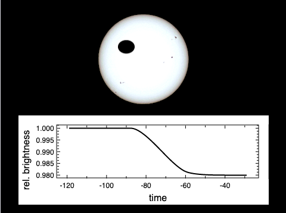
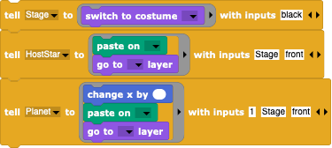

#  Example: Exoplanet Transit

In this example, we'll see how to create a simulated "transit lightcurve" of an exoplanet eclipsing its host star (a "lightcurve" is the brightness of an object versus time).  Observations of transiting exoplanets are the major means of discovering such objects as well as the best means for measuring their properties (size, sometimes mass and hence density). Although the [Eclipsing Binary Simulation](../EclipsingBinary) sounds different, many of the details of the simulation are very similar.

Since we are only interested in the lightcurve immediately before, during, and immediately after the transit, the only properties of the host star and planet that are relevant are 
- the size and appearance of the host star;
- the size of the exoplanet;
- the path of the exoplanet across the face of the host star; since we are only looking at a tiny part of the exoplanet's orbit, we can approximate this as a motion from left to right at some height above the centre of the host star.
Note that exoplanets emit very little light of their own and mostly when one looks at the part of the surface facing the host star, i.e. exactly NOT when the transit occurs (there is a secondary eclipse when the host star eclipses the exoplanet - during these times one can hope to see the exoplanet via it's reflected starlight), so assuming it is simply a black disc is a very good approximation.

We could define a formal exoplanet orbital period and inclination, but - again - we're only interested in a small portion of the orbit.  In fact, we can dispense with any concept of orbital period and orbital phase and simply keep track of the position of the exoplanet as a measure of time or phase.

While it is fine to model the disc of the host star as a uniform disc at first, **real** stars don't have uniform discs - they look like this

(derived from https://en.wikipedia.org/wiki/Sun#/media/File:Sun_white.jpg; the background has been removed).  The edges of the stars are less bright, an effect called "limb-darkening".  This effect is due to the fact that stars are not solid objects but have atmospheres with layers that get thicker, genneraly hotter, and less transparent as one looks deeper and deeper in the star.  At the centre of the star, one can look fairly deeply before the star becomes opaque, but the line-of-sight near the limb encounters more material at higher levels and so becomes opaque where the atmosphere is generally cooler.  Cooler gas emits less light so the limb appears to be darker, giving the disc an artificial 3-D look.  While one could attempt to paint such a disc, the simpler and physically **MUCH** better solution is to take the image of a **REAL** star - i.e. the Sun -- which shows the correct limb darkening behavior **by definition**.  This makes your simulation more realistic than some astronomy graduate students' attempts!

With such simple assumptions, the simulation is easily done:
- create appropriate costumes for the host star and exoplanet and a blank (black) costume for the Stage; we will be pasting the images of the host star and exoplanet on a blackened stage and then reading off the brightness of the Stage as a direct measure of the observable brightness;
- position the exoplanet off to the left or right at some chosen height above the host star centre;
- iterate by moving the exoplanet across the host star and reading off the Stage brightness.
For each iteration:
- clear the *Stage*;
- paste the host star at it's position;
- move the exoplanet a bit and stop if it's gone far enough;
- paste the exoplanet on top of everything;
- measure the brightness of the stage where the host star is.

Because we want to have a plotted lightcurve, it will be good to divide the Stage into an upper part where the simulation actually occurs and a lower part where the lightcurve can be displayed dynamically.

---

## Translation into Snap!

Snap! makes it easy to split the simulation into different sections and to develop (and debug!) them in simple stages.  To make things easier, we can split the simulation into different tasks:
- create costumes for the host star, the exoplanet, and the *Stage*;
- create a loop that moves the exoplanet across the surface of the host star;
- for each iteration, paste the images onto the *Stage*;
- for each iteration, measure the brightness of the relevant part of the *Stage*;
- for each iteration, note the "time" (the x-position of the exoplanet) and brightness and place the result into a lightcurve table;
- for each iteration, plot the lightcurve table in a plot in the lower half of the simulation.

---

### Create the costumes

First, we create two Sprites, the *Planet* and the *HostStar* and give them an appropriate appearance.  The exoplanet can be painted as a simple black circle using the Snap! paint tool.  The host star can also be painted, but one an also take an image of a real star, the Sun, from the internet, as mentioned above: remove the background via a transparent alpha channel, centre it (there's a centring button in the paint tool), and make this realistic image the costume of the host star.

To give the *Stage* a black background costume, again use the paint tool and fill the costume with black paint.  Note that the Stage has to have a costume in order for another Sprite to be able to paste onto it!

The Sprites can be scaled to the desired sizes and placed at their initial positions using their response to the "green flag" broadcast that starts the simulation, e.g.

Thus, right after the "green flag" message is sent, the costumes should be set, and the exoplanet positioned.

---

### Move the exoplanet

Once the exoplanet has been placed at it's initial position, moving it across the *Stage* is simple: use a repeat until block that steps the exoplanet until it has reached its final position:

Within the repeat, we need to ask the exoplanet to step further across the *Stage*:

When this simple simulation is run, you already will have an animation of the situation.

---

### Paste the costumes

In order to read the *Stage*'s brightness, we need to paste our content onto its costume every time the exoplanet is moved.  It matters what order and how the Sprites are displayed: for every iteration,
- first, clear the *Stage* by having it switch to a pure black background costume;
- next, paste the host star's costume onto the *Stage* and let it show itself using

- finally, after moving the exoplanet, have it paste its costume onto the Stage and show itself as well.

Note that "tell" is a good way to give **Sprites** a series of standard commands; for non-standard commands you'll need to use "run" unless you want to have to mention the receiving Sprite twice - once for the receiver, and again to set the non-standard command.

---

### Measuring the brightness of the simulation

Once your simulation runs as expected, we want to calculate the apparent brightness as a function of "time".  This can be easily done using the **Scientific Snap!** [stage brightness](../../StageBrightness)  blocks:
- import the blocks; you'll see e.g. several new "Sensing" blocks;
- create a "brightness" variable to hold the value of the current *Stage* brightness;
- decide which part of the *Stage* needs to be measured (the smaller the area the better - Snap! isn't designed for heavy-duty number-crunching!) and set this region using ;
- during each iteration, after the costumes have all been pasted, load the brightness into the brightness variable via 

---

### Note the "lightcurve"

When your simulation runs, you'll note that the brightness changes are very small; the ratio of the brightness before the transit and at mid-transit is roughly the ratio of the two objects areas, usually much less than a percent.  In order to plot the values, we need to store them in a "lightcurve" table:
- create a "lightcurve" variable and initialize it with an empty list;
- at the end of each iteration, add a list containing the "time" (x-position of the exoplanet) and brightness to the lightcurve list ;
- by asking the "lightcurve" list to display itself (checking the box to the left of the variable), you can inspect all the values in detail.

Since the *Stage* brightness is given as the grayvalue of a giant pixel (between 0 and 255), it's hard to read off by what percent the brightness has changed.  This can be aleviated by noting the starting brightness (the very first value when nothing has happend) and then dividing the rest of the brightnesses by this value, resulting in a relative brightness that is easily interpreted.

---

### Plotting the lightcurve

Finally, we want a plotted lightcurve.  Import the [PlotSprite](../../PlotSprite) from the scientific Snap! collection.  The plot can be displayed every iteration by either
- creating a **PlotSprite** block that reads the global lightcurve table or by
- creating a block that asks the **PlotSprite** to do the same.
In the case of the latter, it might look like

which uses the handy short form command that only needs the data, the size of the plot, the title and axis labels, whether to use lines and/or markers, and the colours of the lines and/or markers.

If you put this block into the "repeat until" loop, the plot will be dynamically created, a new data-point being added each time the *Stage* brightness is measured.

