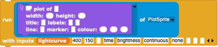

#  Example: Exoplanet Transit

In this example, we'll see how to create a simulated "transit lightcurve" of an exoplanet eclipsing its host star (a "lightcurve" is the brightness of an object versus time).  Observations of transiting exoplanets are the major means of discovering such objects as well as the best means for measuring their properties (size, sometimes mass and hence density). Although the [Eclipsing Binary Simulation](../EclipsingBinary) sounds different, the details of the simulation are nearly identical: replace the exoplanet with a star and let the two massive objects orbit around their common centre-of-mass, and you have a new but very related simulation.

Since we are only interested in the lightcurve, only the properties of the host star and planet that are relevant will be considered:
- a, the orbital separation of the exoplanet (in Snap! coordinates);
- P, the orbital period (in Snap! time);
- e, the orbital eccentricity (i.e. how ellipsoidal the orbit is): we will assume circular orbits for simplicity;
- the sizes of the star and exoplanet relative to the planet's separation;
- the brightness per unit area of the star, physically related to it's temperatures, but in Snap! either the gray value(s) or the RGB colour(s) of the costume; and
- the brightness per unit area of the exoplanet; since most planets hardly shine at all (they are generally not nearly as hot as a star) and only the shadowed side is normally visible during a transit, we'll assume the exoplanet is completely black.
Formally, the exoplanet doesn't orbit around the host star (in an inertial frame), but planets generally have such low masses that the effect can be neglected (this is not true for the eclipsing binary star case!).

Then there are the observer-based properties:
- the orbital inclination (i=0 for a face-on orbit, 90 degrees for an edge-on orbit); for convenience, often uses the cosine of the inclination, cos(i), as the parameter - it is somewhere between 0 (orbit face-on) or 1 (orbit edge-on).

The orbital phase is usually defined as being 0 (or 360 degrees) when the exoplanet is directly in front of the host star and 0.5 (or 180 degrees) when the exoplanet is directly behind the star.

While it is fine to model the disc of the host star as a uniform disc at first, **real** stars don't have uniform discs - they look like this

(derived from https://en.wikipedia.org/wiki/Sun#/media/File:Sun_white.jpg; the background has been removed).  The edges of the stars are less bright, an effect called "limb-darkening".  This effect is due to the fact that stars are not solid objects but have atmospheres with layers that get thicker, genneraly hotter, and less transparent as one looks deeper and deeper in the star.  At the centre of the star, one can look fairly deeply before the star becomes opaque, but the line-of-sight near the limb encounters more material at higher levels and so becomes opaque where the atmosphere is generally cooler.  Cooler gas emits less light so the limb appears to be darker, giving the disc an artificial 3-D look.  While one could attempt to paint such a disc, the simpler and physically **MUCH** better solution is to take the image of a **REAL** star - i.e. the Sun -- which shows the correct limb darkening behavior **by definition**.  This makes your simulation more realistic than some astronomy graduate students' attempts!

For each time iteration, 
- determine the system time using a given time-step;
- calculate the orbital phase using the orbital period P;
- clear the Stage of any previous images and make it black;
- place the two objects at their respective apparent positions, the host star in the middle, the exoplanet in its projected orbit, making sure that the two objects are placed correctly with respect to each other (i.e. which one is in front, which one is in back?);
- measure the brightness of the *Stage*.

---

## Translation into Snap!

Snap! makes it easy to split the simulation into different sections and to develop (and debug!) them in simple stages.  To make things easier, we can split the simulation into three different major tasks:
- for every orbital phase, place the exoplanet at the correct position and make sure that the correct object is placed in front or back of the other one;
- measure the brightness of the simulation;
- plot the brightness as a function of orbital phase.

---

### Placing the stars on the Snap! *Stage*

First, we create two Sprites, the *ExoplanetSprite* and the *HostStarSprite* and give them an appropriate appearance.  The exoplanet can be painted as a simple black circle using the Snap! paint tool.  The host star can also be painted, but one an also take an image of a real star, the Sun, from the internet,  remove the background via a transparent alpha channel, centre it (there's a centring button in the paint tool), and make this realistic image the costume of the host star.  The Sprites can then be scaled to the desired sizes using an initial

For every time iteration, we need to calculate an orbital phase.  Since the trigonometric functions in Snap! take angles in degrees, we'll express the phase in degrees as well.  The running phase is simply then 360\*t/P, but we want a phase that stays within 0 to 360 degrees so we can always see what's going on: use the floor function to remove the non-decimal part of the phase

The x-position of the exoplanet depends the separation, phase, and orbital inclination. If you've already done the [Eclipsing Binary](../EclipsingBinary) example, you already have a generic block that places a Sprite at the right position for a given set of orbital parameters (use the phase offset of the secondary star and a mass-ratio of zero), but here we'll give the *ExoplanetSprite* it's own positioning method.

Within this block, the logical projected x-position for an orbit that is foreshortened only in the y-direction uses a cosine function that first gives the Cartesian position, but we'll add a geometrical phase offset that must be adjusted to give the right phase behaviour.

Note that for orbital phase=0 and offset=0, the x-position would be *separation*, whereas it should be 0, so the phase offset for our exoplanet must be 90 or 270 degrees (cos(90)=cos(270)).

The corresponding projected y-position is fore-shortened by a factor of cos(i):

Note that for phase=0 and offset=90, the y-position would be *separation cos(i)*, i.e. positive: this is the desired position of the host star behind the exoplanet, not the exoplanet itself; this fixes the functional phase offset for the exoplanet.  You may want to add an additional y-offset to the position to place the simulation at a more convenient position - we want to add a plot to the *Stage* later on.

Now, for each calculated time, we can compute a phase and, for that phase, tell the exoplanet to move the corresponding position as a function of phase.  Between calculations, we increment the time by some amount.  Place the calculation of phase, the positioning of the exoplanet, and the time increment in an infinite loop, give the time a starting value of 0, and see what happens.

Since you probably only displayed the costume of the host star at the very beginning of the simulation, you will have noticed that it matters what order the Sprites are displayed: the exoplanet should eclipse the host star at phase 0 but be eclipsed at phase 180 degrees.  This can be fixed by showing the costumes for each iteration and displaying them in the correct order.  Which Sprite is shown at the upper display level is set by invoking

Stick in an "if ... then ..." control block and duplicate your costume display commands, switching the order for the exoplanet and host star for 1/2 of the orbit.

---

### Measuring the brightness of the simulation

Once your simulation runs as expected, we want to calculate the apparent brightness as a function of orbital phase.  This can be easily done using the **Scientific Snap!** [stage brightness](../../StageBrightness)  blocks:
- Import the blocks; you'll see e.g. several new "Sensing" blocks. 
- Decide which part of the *Stage* needs to be measured (the smaller the area the better - Snap! isn't designed for heavy-duty number-crunching!) and set this region using 
- clear the *Stage* of any previous images, restoring it to its original pitch-blackness;
- "paste" some Sprite (e.g. the *HostStarSprite* in the middle) onto the Stage using [go to front layer paste on Stage](./images/go_to_front_layer_paste_on_Stage.png)
- From the "Sensing" block menu, pull a  block to your workspace.
- Press the block and you should see a report of the gray value of the region you have chosen (if the simulation has already run and something has been pasted on the *Stage*); you should also see a new global variable called "stage brightness area" containing the (xmin,xmax,ymin,ymax) of the region as a check.

Note that the Stage has to have a costume in order for another Sprite to be able to paste onto it!

When your simulation runs, the phase changes very rapidly, so it's hard to see how the brightness changes during the transits.  A better approach is to store the values each time a brightness is calculated so that we can inspect the values (and, soon, plot them) later.
- Create a "lightcurve" variable and initialize it with an empty list.
- at the end of each iteration, add a list containing the phase and brightness to the lightcurve list .
- By asking the "lightcurve" list to display itself, you can inspect all the values in detail.

If all that we're interested in is the range of values (e.g. to determine the depth of the deepest eclipse), we can run the simulation, filling the "lightcurve", and then go through all of the values, looking for the minimum and the maximum brightnesses.

---

### Plotting the brightness as a function of orbital phase

Finally, we want a plotted lightcurve.  Import the [PlotSprite](../../PlotSprite) and give it a new **internal** (!) block called "plot"

This block uses the global lightcurve data list, gives the plot reasonable limits and labels, and creates a new plot costume for itself.  To invoke the plot, simply ask the *PlotSprite* to run it's plot block

If you put this block into the infinite loop, the plot will be dynamically created, a new data-point being added each time the *Stage* brightness is measured.

