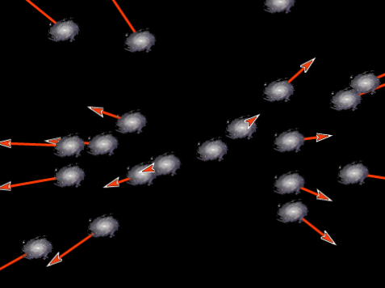
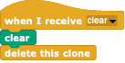
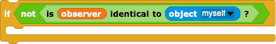
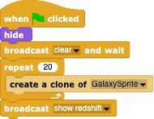

#  Example: Expansion of the Universe

In this example, we'll see how to simulate the observable effects of the expansion of the Universe.

## Introduction

In 1927, George Lemaitre predicted that the Universe might be expanding, based his solution of Einsteins *General Theory of Relativity*.  If so, the more distant the galaxies are from each other, the larger the effect should be. The usual simple model of what is happening is that the universe is like a cake with raisins in it: as it is baked, the volume of the cake gets larger so the distance between the raisins increases, with nearby raisins moving slowly apart and distant raisons moving faster.  Edwin Hubble, who had access to the largest telescopes of his day, measured the apparent velocity of many galaxies by studying the wavelength shift of identifiable spectral lines in their spectra, and tried to estimate their distances using their sizes and brightnesses.  Sure enough, there was a direct proportionality between apparent velocity v and distance d: v = H\*d, where "H" is now called the "Hubble" (or "Hubble-Lemaitre") constant and has the value of about 70 km/s/Mpc.

Even though we look out and see all of the (distant) galaxies moving away from us, we are not in any special location: all of the raisins in the cake see the same effect, so all observers is all galaxies see all of the other galaxies moving away from them.  The purpose of this simulation is to demonstrate that all galaxies are see the same effect.

The design of this simulation is very straight-forward.
- We first ask the *Stage* to make itself appropriately black.
- We then create many clones of a GalaxySprite that spread themselves all over the *Stage*.
- When a *GalaxySprite* clone is created, it positions itself randomly on the Stage, creates its own clone of an *ArrowSprite* that is going to show the galaxy's relative motion to an observer, and makes itself the **observer** (a global variable that gets re-set to each new *GalaxySprite* clone as it is created so that there is always just one observer).
- When a *GalaxySprite* is clicked, it tells all of the other galaxies that it is the new **observer** and asks them to re-draw their *ArrowSprite* clones.
- The length of each *ArrowSprite* clone is proportional to the distance to the current **observer**.

If we put all of the "programming intelligence" into the other *Sprite*s, then the *Simulation* *Sprite* is nother other than 

---

## Creating a black *Stage*

Making the *Stage* black is simple:
- go to the *Stage*'s "Backgrounds" tab, and click the "Paint a new costume" tool;
- in the tool, select the colour black;
- select the fill tool and fill the *Stage* with black colour.

---

## The *ArrowSpite*s

We want a *Sprite* that can be told to draw a line from one point to another so that when it is finished, the natural *Snap!* *Sprite* arrow head is visible and points in the right direction.  Since this kind of functionality is standard *Snap!* stuff, this *Sprite* is trivial to programme:
when the "green flag" is clicked, set the basic properties of the *Sprite*: size, color, and pen size.

When the *ArrowSprite* is used, it's galaxy will have to position it, point it in the right direction, and tell it how far to draw.

When a new simulation is made, we will need to tell all clones to clear their graphics, so each *ArrowSprite* clone should respond to a "clear" broadcast by clearing and deleting itself.

---

## The *GalaxySprite*s

Most of the interesting programming needs to be done for the galaxies.

When a *GalaxySprite* clone is created,
- it's costume needs to be set and sized;
- it needs to set it's **my arrow** variable to a new clone of *ArrowSprite*; 
 
- it needs to position itself randomly on the *Stage* (use  along with the current size of the *Stage* using, e.g.  to get truly random positions no matter how big your *Stage* is);
- it needs to tell it's *ArrowSprite* to go to the same position as the galaxy; 
 
- and then it should show itself.

When a "new observer" broadcast is received, the galaxy needs to tell it's arrow to clear it's graphics (the stem of the arrow) and hide itself for later use.

When the galaxy receives a "show redshift" broadcast and isn't the **observer**,

it has to tell it's arrow to re-draw itself.  For that it needs to get the new distance to the (potentially new) **observer**, scaled by some factor which gives the length of the arrow: .  Then, it has to tell it's arrow to 
- drop it's pen;
- point in the right direction, which is opposite of the normal direction **to** an object, so you'll need to add/subtract 180 degrees to get the right direction ;
- move the number of steps needed to produce an arrow of the right length;
- pull up it's pen again; and
- show itself.
All of this is easily put into a "tell ... to ... with inputs ..." block.

Finally, when a galaxy is clicked, it should become the new observer: within a "when I am clicked" header, it needs
- to broadcast that there is a "new observer" and wait for all to respond (so that they can all turn off their arrows);
- to set the global **observer** variable to ; and
- to broadcast "show redshift" so that all the other galaxies can show their arrows pointing away from the new **observer**.

When a new simulation is made, each *GalaxySprite* clone should respond to a "clear" broadcast by deleting itself.

---

## The simulation

All that is left is to have the *Simulation* *Sprite*  respond to a "green flag" broadcast by
- hiding itself;
- broadcasting a "clear" message to remove all previous galaxies and arrows;
- create a large number of *GalaxySprite* clones; and
- tell all the galaxies to show their redshift arrows relative to the current **observer** (the last clone created).

By repeatedly clicking the "green flag", you'll get new universes filled with new galaxies and new observers. Within any universe, if you click a galaxy, it will become the new **observer** and you'll see the motion of the other galaxies due to the expanding universe in the eyes of a new observer.  No matter what galaxy you click, the observer will always see the same effect but from different galaxies with different arrows.

---

## Improvments to your simulation

- Add a green dot to the current observer so the galaxy with the observer is easier to see.  This is most easily done by giving the *ArrowSprite*s alternative costumes - either the normal "Turtle" arrow or a little green dot you can easily create in the *Sprite*'s costume editor.

- Of course, the simulation above doesn't actually show the expansion itself: the lengths of the arrows are proportional to the distance, indicating what one would see.  Change your simulation so that an actual expanding universe occurs: start all of the galaxies near the centre and have them expand away from that centre, adjusting their arrow's lengths.  Strictly speaking, this is a bad simulation, since the Universe didn't start from a centre and expand out into space: it creates its own space as it goes, so probably a **better** simulation effect is simply to pull on the size tab of the *Stage* and make your Universe expand!  Even this isn't realistic, since the expansion of the Universe doesn't result in the expansion of the galaxies, so you'd have to actually increase the **pixel** size of the *Stage*.

