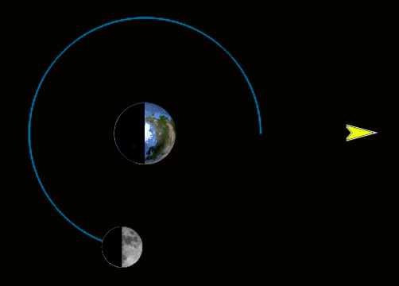
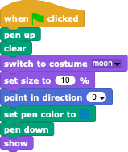
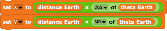
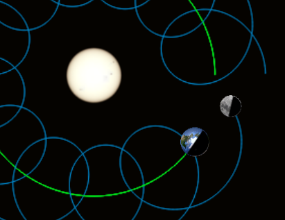
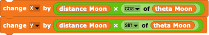

#  Example: Lunar Phases

In this relatively simple example, we'll see how to simulate the geometry that produces Lunar phases using the classic **Snap!** programming techniques of positioning and rotating Sprites.  

For simplicity, we will not try to show the objects in their true relative sizes and distances, but let the Moon go around the Earth in a simple circular orbit and the Earth around the Sun in another circular orbit. We can split the simulation into three major versions.
- Model just the Earth and Moon, load realistic costumes for both bodies and let the Moon move around the Earth in a circle of given radius.
- Add the shadows to the Earth and Moon.
- Add the Sun as a body and make the Earth-Moon system orbit around it.

---

### Getting the Images

To make things simple, one can use standard images of the Earth, Moon, and Sun but note that we will be placing the images in the plane of the Earth's orbit where we will be looking at the Earth and Moon from above (or below).  A polar view of the Earth is easily found in the internet, but a polar view of the Moon is harder to find.

We will also be needing masks for the Earth and Moon to darken the sides facing away from the Sun: various paint and image processing programmes can take an image, let you cut out 1/2 of it (for the non-shadowed region) and remove the rest (including the background) by setting the non-useful part of the image to be transparent (the "alpha" channel).  In a pinch, one can create a half-circle using the *Snap!* icon tool and size it to match the underlying image.  You can also use the icon tool to rotate your images by flipping them vertically or horizontally.

If you don't want to make your own images, you can use the images found in the local "images" directory here, derived from https://en.wikipedia.org/wiki/Sun#/media/File:Sun_white.jpg and the NASA video at https://en.wikipedia.org/wiki/File:Pulse_of_Snow_and_Sea_Ice.ogv.

---

### Version I : A simple Earth-Moon model

Even if you are familiar with the basic motion of the Moon around the Earth and the Earth around the Sun, the motion of the Moon is complicated by the fact that we always see nearly the same view of the Lunar surface no matter where the Moon is in it's orbit.  This is due to tidal forces cause by the non-spherical shapes of the bodies.  Even though there is in fact a very small shift in the face of the Moon (due to the non-circular orbit), we just want to simulate what causes the phases of the Moon and so will assume that the Moon rotates at a period exactly equal to the orbital period, causing the same point on the edge to be closest to the Earth at all times.  In Snap!, this means that we not only need to move the Moon's **Sprite** but need to rotate it as well.

First, create **Sprite**s for the Earth, the Moon, and for their shadows.  Each **Sprite** will need to be resized to match the size of the Snap! Stage and the shadows need to be the same size (or slightly smaller) as their bodies.  The Earth should be positioned at the origin.  All of these initializations are easily done using responses to the "green flag" broadcast, e.g.

The simulation **Sprite** that drives the motion needs to know the radius of the Moon's orbit and the Lunar phase (the angle of the Moon relative to the Earth), so we create a (global?) variables "distance Moon" and "theta Moon" and initialize them to reasonable values.  We also need "x" and "y" variables to hold the Position of the Moon.

Within a "forever" loop, calculate the position of the Moon using the current "theta Moon" value and the usual sine and cosine functions

then tell the Moon **Sprite** to move to that position,

and, finally, increment the angle of the Moon's orbit at the end of each iteration.  If you want, you can ask the Moon to leave it's pen down while moving so that you can see the outline of the orbit.

Once this simplest simulation works, add the rotation of the Moon by telling the Moon not only to change it's position, but also to rotate in the proper manner.  In **Snap!**, the #[point](./images/point_in_direction.png) block causes the **Sprite** to rotate itself so that it points in a particular direction, but an even better block is the one that points one Sprite in the direction of another:

Using this pointing possibility means that you will have no control over the rotation of the object (other than creating the original image with the "correct" rotation).  A more general-purpose approach would be to actively point the **Sprite** in a particular direction and to correct that angle for any original rotations of the costume.

When the simulation runs, it seems strange to see the Moon rotate like this: we're used to seeing the same face, giving the impression that the Moon doesn't rotate at all.

---

### Version II : Adding the shadows

Assume that the Sun lies far away off in a particular direction, e.g. off to the right.  That means the light from the Sun only illuminates 1/2 of the faces of the Earth and Sun.  To simulate this, we need to place shadow **Sprite**s on top of the Earth and Moon images that always cover the 1/2 of the bodies facing away from the Sun.

Create **Sprite**s for the Earth and Moon shadows and let them initialize themselves to the correct positions, rotations, and sizes.  You may want to resize the shadows so that they are a bit smaller, so that one can better see that the underlying bodies are circular.

Since the shadows always face in the same direction, adding their presence to the infinite loop is trivial: after positioning the Moon, tell the Moon's shadow to go to the same position.  To insure that the shadow is always on top of the underlying object, you may need to place it on the "front" layer:

---

### Version III : Adding the Motion around the Sun

To add the motion around the Sun, we replace the Sun **Sprite** as the object at the origin and ask the Earth to rotate around it.  This means re-cycling much of your previous code: the Sun does what the Earth did earlier (being placed at the center) and the Earth does what the Moon did previously.  Simply globally re-name the "distance Moon" and "theta Moon" variables to "distance Earth" and "theta Earth".   Whether you want to rotate the Earth to let the same face point towards the Sun or not is left up to you.  The only major difference is that the Sun doesn't need a shadow mask, of course!

Once the Earth orbits around the Sun, we want to re-add the Moon.
- Add "distance Moon" and "theta Moon" variables again, this time with a much smaller distance value.
- Since the Moon moves with the Earth, we can use the Earth's position as the first part of the Moon's position and simply correct that position with the additional motion of the Moon around the Earth

- If your shadow masks are rotated correctly, all you will need to do is to make sure the Earth and Moon shadow masks remain pointed towards the Sun and the Moon and the Moon towards the Earth.
- In this global simulation, we have to take into consideration that the Moon's orbital period is much less than the Earth's.  This means that the incremental change in the orbital angle "theta Moon" made at the end of each iteration is larger than that of the Earth by a factor of the orbital period ratios, 365.25/27.322 (don't use the Moon's "synodic" period of 29.530 days - that is the apparent period we see from a moving object, the Earth).  You may want to slow down the Earth in order to see the Moon's rotation.

---

### Final Touches

While these simulations illustrate how the phases of the Moon are produced, they don't show the actual phases themselves - we're looking down at the Earth-Moon system, not from the Earth to the Moon (that would be a great but different simulation!).  To help the viewer see what phases are created, we can add lines from the Earth to the Moon that indicate what parts of the Moon are seen.  In the simplest form, we can add a single dynamic line from the Earth to the Moon showing whether the centre of the Moon as viewed from the Earth is illuminated or shadowed.

There are two very different ways to animate things in *Snap!*:
- you can position, resize, and rotate the costumes of **Sprite**s or
- you can use **Sprite**s to draw something on the **Stage** and refresh that drawing every iteration.
Obviously, the 1st method is simpler and the results are better - *Snap!* is already set up to do this kind of animation, so the results will be faster and smoother.  This means we need a "Connector" **Sprite** whose centre is at one end and whose length has been adjusted to correspond to the current Earth-Moon distance.

The line is easily drawn and the effective centre of the costume is easily set at the end of the line using the *Snap!* icon editor.

For each iteration, we then only need to position the Connector at the position of the Earth and have it point itself towards the Moon.

Here, we have using the "(property) of (Sprite)" block to get the coordinates of the Earth, since the original "x" and "y" positions were changed to be those of the the Moon (we could have used "x" and "y" as the Connector position and then pointed the line at the Earth!).  Note also, that we have pushed the line costume to the back of the Stage so that the line is underneath the costumes of the Earth and Moon (we could have positioned the Connector first and then positioned the Earth and Moon, but that would mean messing around with our original code).

Voila!  The simulation now helps the viewer to see what part of the Moon is illuminated as viewed from the Earth.  It would be better to add two lines that go from the Earth's surface to the edges of the Moon - that's the total extent of the Moon as viewed from the Earth - but that would be a bit more difficult.

