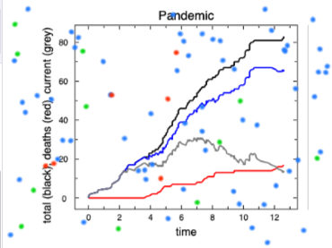

#  Example: Pandemic

This being the year 2020, we'll see how to simulate the evolution of a pandemic.

---

---

The modelling of the evolution of pandemics is one of the central tools used in public medicine to combat outbreaks of contagious diseases.  Of course, the models used contain a wide range of different components and effects - e.g. geographical factors, population densities, age distributions, realistic travel patterns.  Here, we want to reduce the problem to a set of minimum effects by assuming we have a small group of persons moving randomly in a closed area and  hence randomly meeting each other.  The parameters of the disease are simply modelled:

- A person is either "healthy" (i.e. uninfected), "contagious" (i.e. newly infected and in danger), or "recouperated" (no longer contagious or in danger).
- If a person gets too close to an "infected" person, there is a finite chance of becoming "infected" (e.g. because of the use of masks).
- The infection immediately results in the person being "contagious".
- The period of being "contagious" is limited to a short time; thereafter, the person is "recouperated".
- During the "infected" phase, there is a finite chance of mortality.

---

### The Snap! Simulation

Our simulation needs the following basic parameters:

- number of persons
- infectious distance (if too large a distance, no infection can occur; more on this later)
- chance of infection after contact
- duration of the infectious phase (expressed, e.g., as the number of simple iterations)
- mortality rate

All of the details for each of the persons - their position and motion, the act of infection, and whether they succome to the disease - is left to a PersonSprite.  The simulation sprite organizes everything else :

- gives the basic parameters their values;
- removes any left-over PersonSprites from the last simulation, e.g. via a broadcast

- creates an infected PersonSprite;
- creates a large number of healthy PersonSprite clones;
- enters an infinite loop where each PersonSprite clone is told to move and check for infections.

Before we begin, note that we are going to be dealing with probabilities, so it would be handy to have a real random number generator that returns a number between 0 and 1

here with a finite but adequate resolution of 0.0001 (the standard Snap!  block only returns whole numbers within some whole number range)

When a clone of PersonSprite is created, it needs to
- place itself randomly on the Stage;
- point in a random direction;
- set it's (private) health state variable to "healthy";
- set it's (private) infection timer to zero; once infected, the person has to wait for the infection to go away, and the easiest way to do this is to have a private timer that is set and is decremented by 1 until it is zero (end of the infectious stage);
- set the costume to a "healthy" appearance.

The PersonSprite needs to respond to two different broadcasts, "remove all persons"

and "next", the iteration message from the simulation.  For every "next", the PersonSprite should
- turn randomly by some amount, either left or right;
- move forward some steps;
- check to see if the edge was reached - Snap! provides a handy  block that will send the Sprite back into the Stage if it tries to exit;
- if the person is "healthy", she should check to see if there are any "neighbors" (a standard function in Snap! that returns a list of Sprites within a distance of ??? so that one doesn't have to test ALL of the Sprites on the Stage);
- if there are neighbors within the infection distance, ask if they are "infectious" and use the  block to see if an infection occurs;
- if the person is infected, set the infection timer and change the costume to an "infectious" appearance (e.g. a red colour);
- no matter whether an infection occured or not, if the person's infection timer is > 0, reduce it by one.
- if the infection timer is set to zero, then the infectious time is over - the patient is now "recouperated" and no longer a danger to the "healthy" persons.
- if the person is "infectious", there is a finite chance of succuming to the disease, in which case the clone is removed.

---

### Using your Simulation

Once your simulation runs, you can see how the different parameters of the disease affect the evolution of the pandemia.
- How do masks help (change the probability of infection)?
- How does social distancing help (change the infection distance: a smaller value is, strangely enough, like social distancing, since it makes it harder to get infected)?
- How do the parameters affect the ability of the population to achieve "herd immunity" (just "healthy" and "recouperated" persons) and at what cost (number of persons that died)?
- Change the random motion to directed motion (e.g. the persons only move between airports) - how does this change the results?
- Add some book-keeping of what happens during your pandemic and use [PlotSprite](../../PlotSprite) so that you can plot the number of infections/deaths as a function of time.
