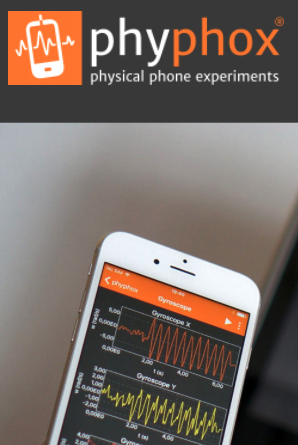
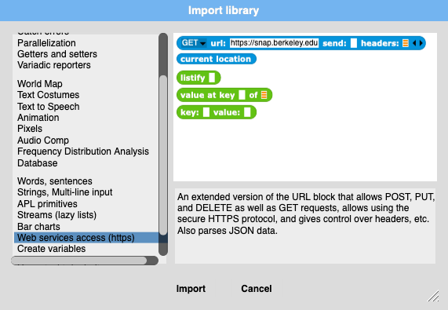
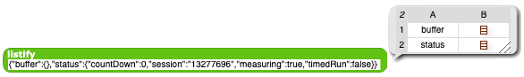
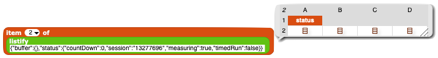
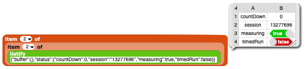
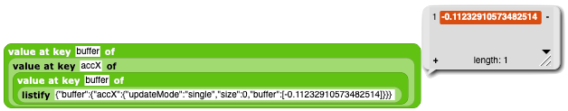

#  Example: Remote Sensing 

In this example, we'll see how to download remote sensor data from a mobile phone running the *phyphox* App, process it, and plot the results in real time.

---

## Introduction

Part of the modern digital revolution is the possibility of easily gathering large amounts of data, from which, e.g., new information can be derived (e.g. in marketing) or public warnings can be given (e.g. traffic jams found by mobile phone densities, extreme weather events from networks of weather stations).  Rarely are the raw data themselves interesting - almost always, one gathers raw information from multiple sensors and then processes that raw information into useful information. For example, hundreds of mobile-phone contacts are necessary to define a traffic situation accurately in a small urban region because the densities not the contacts themselves are needed.

---

## phyphox

This App has been produced by the University of Aachen in Germany to make the multiple devices in a mobile phone available as an amazing array of physical sensors: position (GPS), 3-D acceleration, rotation, pressure, microphone, magnetic field strength, and brightness.  While an equally amazing array of experiments are organized within the App to make the phone self-contained (e.g. Doppler velocity measurements using the speaker and microphone!), the App also offers the possibility of accessing the sensors' values via WIFI and a simple HTTP protocol.

After you have installed and started the App (see [this link](https://phyphox.org/)),
- pick out the equivalent experiment (e.g. );
- select "allow remote access" in the menu and confirm that you want to allow *Snap!* to access your phone;
- you will see the internet address of the phone at the bottom, e.g. "http://192.168.0.13:8080" ("http" is the protocoll, "192.168.0.13" is the internet address, and "8080" is the so-called "port-number");
- if you enter this address in a browser window, you will see the same standard *phyphox* interface on your second device; this is a good way to double-check your connection;
- start an appropriate *phyphox* experiment, e.g. "Acceleration (without g)", and press the triangular "run" button to start the measurements.

At this point, *phyphox* is willing to share the data with your *Snap!* programme.  You can get the status of the measurements by giving the following URL in a browser:

<tt>http://192.168.0.13/get?status</tt>

(use the correct IP address at the bottom; if nothing happens, make sure that *phyphox* is really measuring).  *phyphox* should return something like the following in your browser:

<tt>{"buffer":{},"status":{"countDown":0,"session":"13277696","measuring":true,"timedRun":false}}</tt>

(you may have to change the output format in our browser to see this raw detail).
This information is in the form of a dictionary - a set of keyword:value pairs contained within two curly brakets (in "JSON" format, a format commonly used between programmes dealing with the internet).  Literally, this particular information says that there is a "buffer" containing nothing, there is a "status" which is a dictionary with the keyword entries "countDown", "session", "measuring", and "timedRun", each with a value (these keywords and values aren't interesting now).  While one could parse this string by hand, looking for dictionaries in dictionaries in dictionaries, the *Snap!* "Web Services" library provides blocks to do this for you.

For instance, when the output above is passed to the "listify" block (transforms JSON into lists of lists), it transforms the JSON into a list of two lists (the "buffer" and the "status" lists).

If we are interested in the "status" list, we access it using

which gives us a list containing the name of the list ("status") and its contents, 4 entries.  Yes, to go down even further, we need another level of probing with another "item ... of .." block:

which yields the final values, two numbers and two "booleans" (trues or falses).

Each of the *phyphox* sensors has it's own *phyphox* name:

| Name  | sensor  |
| ----  | ------  |
| accX  | acceleration in the x-direction  |
| accY  | acceleration in the y-direction  |
| accZ  | acceleration in the z-direction  |
| ...   | ...  | 

To access the sensors, we need to change the HTTP command given the *phyphox* server on the phone.   This is done by adding the sensor names after the "get?" string of the command, each sensor name separated by the ltetter "&" (ampersand).  For instance, if we want the x-acceleration, we ask

<tt>http://192.168.0.13/get?accX</tt>

and get the response

<tt>{"buffer":{"accX":{"updateMode":"single","size":0,"buffer":[-0.11232910573482514]}}, ...}</tt>

(the uninteresting "status" info represented by "..." has been removed to make things look simpler). This time, the main "buffer" contains a dictionary with an entry for the x-acceleration "accX" which contains, among other things, a "buffer" with the actual sensor value, "-0.11232910573482514", in the SI units "m/s^2". We could try to use "item of (item of (item of ...))" but this only uses the position in the lists, not the keys of the dictionary.  A better way is to use the Library's "value at key ... of ..." block. Then, to get at this value, we need only follow the hierarchy of dictionary keys: to get at the "buffer" within "accX" within the main "buffer", we can use

