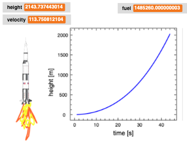
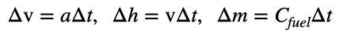
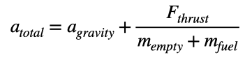
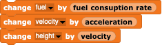
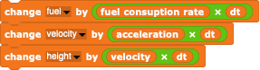
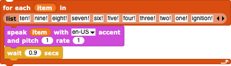
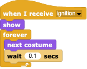
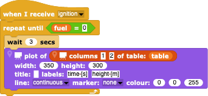

#  Example: Saturn V Rocket

In this example, we'll see what it takes to launch a Saturn V rocket into space - at least the very first stage.

To understand how a rocket works, one only needs to unterstand a few things.
- Newton's law says that the force F on a body is equal to the mass m times the acceleration a of the body (F=ma).
- Most rocket engines have constant "thrusts", i.e. constant forces that can be imparted to propell the rocket forward (actually some rockets often have variable thrusts depending upon the variable rate of fuel consumption, but we'll ignore this fact).
- The thrust can be imparted as long as the rocket has fuel.
- The acceleration due to the thrust force depends upon the total mass of the rocket, which is constantly changing due to the loss of mass via the consumption of fuel.
- The rocket thus starts with lots of fuel and hence lots of mass, which makes the rocket slowly accelerate at the beginning.
- As the fuel is used up, the mass of the rocket decreases, which makes the rocket accelerate more rapidly due to the constant force (F=const, a=F/m, m is getting smaller so a is getting larger).
- The change in the velocity over a short time is the acceleration times that time interval.
- The similar change in the height is the velocity times that time interval.
- The similar change in the fuel mass is the consumption rate C times that time interval.

Thus the final height reached by the rocket depends upon the combination of several factors:
- the empty mass of the rocket;
- the mass of the fuel at the beginning;
- the thrust of the rocket engines;
- the fuel consumption rate; and of course
- the acceleration of gravity of the Earth trying to pull the rocket down (-9.8 m/s/s).

To simulate a rocket launch, we need the above parameters at the start and then for every time-step, we need to calculate 
- how much fuel is left and hence the current mass of the rocket;
- if there's fuel, we have a total acceleration of

- from the current total acceleration a, calculate the change in the velocity;
- from the current velocity v, calculate the change in the height;
- from the fuel consumption rate C, decrease the remaining mass of the fuel.

The simulation can be stopped when one runs out of fuel (time to eject the first stage!) or when the rocket hits the Earth (time to pick up the pieces!).  If one follows the height past the time when the fuel is out, then the rocket is simply like a rock that has been tossed up - it will come down again.

Obviously, if the rocket has too small a thrust, has too large a fuel consumption, has too large an empty mass, or if the fuel has too large an initial mass, the rocket won't budge or won't get very far off the ground.

---

## Implement in *Snap!*

First we need to set the basic parameters of a Saturn V rocket first stage.
Some of them can be found in the internet, in particular the thrust and the fuel mass.

while others aren't so easily found and so have to be estimated.  The consumption can be estimated from the fuel mass and the length of time the 1st stage was working.  The empty mass can be found by finding the consumption rate that works for the historic performance of the Saturn V 1st stage - one can guess that most of the total initial mass in contained in the fuel.

The basic *SimulationSprite* doesn't have much to do other than igniting the rocket

All of the work is done, of course, by the rocket.  When it is ignited, it simply runs until the fuel is consumed

Within this loop, one calculates the current acceleration

modifies the amount of fuel, the velocity, and the height

assuming that the rocket gets off the ground at all!!! - you need to check for this unfortunate situation which hasn't been checked for here!  In these blocks, we have assumed that each iteration lasts 1 second; the actual time-step could be set to something else if we have a time-step variable set and multiple these things by it.

If the simulation is too fast, you can slow it down to a realistic speed by sticking in a wait block

At the end of the simulation, you know how far off the ground the rocket got. Of course, you can apply this simulation to *any* rocket, including your own if you are a hobby rocketeer!  In this case, you may want to make additional changes...
- Track not just the vertical motion of the rocket but it's horizontal motion as well.
- Add the friction due to the air by adding a frictional acceleration dependent on the rocket's speed.
- Make a *SpaceXSimulation* by being able to modify the thrust so that the rocket touches down again (not so hard as a simulation, since the rocket could weigh very little at the end, making it easier to come down and land softly).

---

## Adding some nice *Snap!* touches

Of course, no rocket launch is complete without a real spoken countdown

and you can give your *RocketSprite* an historically correct costume.  If you want to see when the rocket is operating, why not give it's back-end  a nice *FlameSprite* with lots of different fiery costumes

that turn off when the rocket runs out of fuel

Since this is a **scientific** simulation, we should add a plot of the rockets performance.
- Add a  to your project.
- Add a data table for the times (iteration number if each iteration takes 1 second) and heights.
- When the rocket starts, have it initialize the table with an empty list.
- For each iteration, add a list containing the time and height to the table.
- Let the *PlotSprite* plot every now and then, at least until the fuel runs out:

