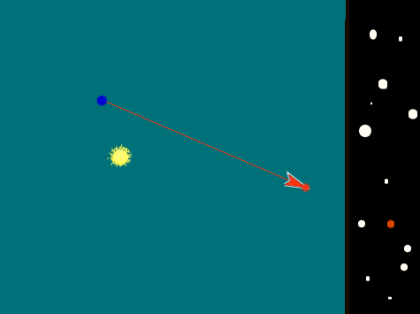
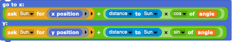
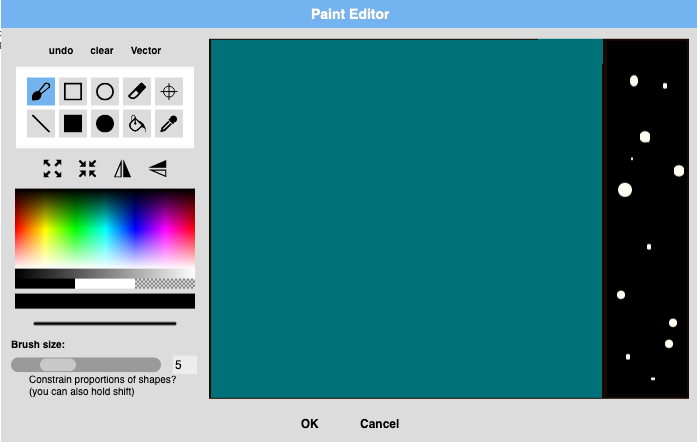
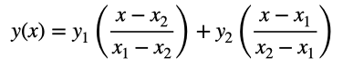
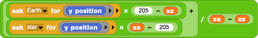

#  Example: Stellar Parallax

In this example, we'll see how to simulate the apparent motion of nearby stars due to the Earth's orbital motion around the Sun.

---

## Introduction

Probably no other astronomical discovery was more profound than when Friedrich Bessel measured the distance to one of the most nearby stars, called 61 Cygni, in 1838.  While it had been assumed before that the stars might be like the Sun and hence very far away (the Sun is very very bright and the stars are very very faint), no one really knew until Bessel proved it.  The technique that Bessel used was to measure the effects of *Stellar Parallax*.

Stellar Parallax is the apparent motion of distant stars on the sky due to the motion of the Earth around the Sun. This phenomenon is known to us in our normal lives as *stereoscopic vision*: the view of a nearby object is different when viewed from different perspectives (e.g. from a left and from a right eye) compared with objects that are much farther away.  The farther away the nearby object is, the less effect one sees.  The farther apart the views are, the more effect one sees.  In astronomy, the nearby object is a star, the two views are images taken of the star about 1/2 year apart (when the Earth is at very different positions in its orbit around the Sun), and the background against which one sees the apparent motion is the pattern of very distant stars and galaxies.  Whereas Bessel could only measure the distances to the very most nearby stars (an amazing feat considering he used a small if very specialized telescope and his own eyes), modern astrometric satellites like GAIA can measure the distances to stars at the center of our Galaxy a thousand times farther away using the same method.

To simulate stellar parallax, we need:
- the Sun;
- the Earth orbiting around the Sun at some distance;
- a not-to-distant Star;
- a pointer from the Earth to the Star (showing in what direction one is looking);
- an apparent image of the Star moving within...
- a nice stellar background.

---

## Our first simulation: the Earth going around the Sun

This is the really easy part.  When the "green flag" broadcast is triggered, we want the Earth to orbit around the Sun.
- Create a **Sprite** for the Earth and the Sun and give them nice costumes.
- Give the Earth an "angle" variable to keep track of where it is in it's orbit.
- In a "forever" loop, increment the angle by, say, 1 every iteration.
- Get the , so that you can calculate the Earth's relative x- and y-positions within the orbit using the orbital angle.
- Get the x- and y-position of the Sun on the Stage using .
- Calculate the final position of the Earth (Sun's position plus the relative positions) and ask it to move to that new position.

The nice thing about this programming technique - asking the Sun for it's instantaneous position and distance - is that one can dynamically change the position of the Sun or Earth and they will respond by using a different Sun position or Sun-Earth distance.  This way, you can easily change your simulation later to model relatively close stars (using a big Earth orbit) or relatively far away stars (using a very tight Earth orbit) - simply move the Earth closer or farther away from the Sun and the Earth Sprite will automatically adjust it's orbit.

---

## Add the nearby star and a pointer

Now we add a star whose apparent motion we eventually want to see.
- Create a **Sprite** for the Star.
- Position the Star somewhere off to the side.
- Create an **ArrowSprite** that will draw an arrow from the Earth to th Star, showing how the viewing direction changes as the Earth moves.  You can use the default Snap! Arrow as a good arrow end that we can easily point in the direction of the Star using - what else? - .
- Add a forever loop to **ArrowSprite** that stars when the "green flag" signal is given in which the **Sprite** first clears its graphics, then goes to the position of the Earth, points towards the Star, puts its pen down, draws a line to the position of the Star, and then pulls it's pen up again.  No matter what you do - e.g. even if you change the position of the Star by hand - the **ArrowSprite** will always point from the Earth to the Star.
This part of the simulation is amazingly easy to programme!

---

## Add a starry background

We want to see the apparent motion of the Star against a nice starry background.  The easiest thing to do is to give our **Stage** the right appearance.  Select the Stage's Costumes tab and create a new costume using the Snap! costume editor.  Add a black region off to the right or left which will be our starry background and fill it with quite a few stars so that we will be able to see the Star's apparent motion against it.  The Sun, Earth, and Star do their thing in the other region.

---

## Add an apparent star projected against the background

This is the only somewhat tricky programming task: given the Sun, the Earth, and an arrow between the two, how can we create an apparent star on our starry background that constantly follows what everything else is doing?

The first obvious step is to create an **ApparentStar** Sprite we can place at the right position.... somehow.

There are (at least) two obvious ways to solve this problem, one using classic Snap! programming techniques and another some maths:
- Using Snap!: the **ArrowSprite** is always pointing towards the Star and by drawing the arrow the Sprite always ends up at the position of the Star, pointing in the right direction; simply have it continue along this corrrect path until it reaches the starry background and  have it tell the **ApparentStar** to go to this position.
- Mathematically, the Sun and Earth - each of which has a well-defined x- and y-position - define a line.  We want to extend this line to a different x-position (that of the starry background).  The simple interpolating function that gives the y-value of any point along such a line is

Note how this function works: when the x-value is either that of point #1 or point #2, one of the two terms is always either the y-positions of point #1 or point #2 and the other unwanted term is zero.  Since this function is linear in x (no other functions or powers of x), it will always give you the correct y-value for a line between the two points as well as in front and back.  If our two points are the Sun and the Earth, this function will give us the y-position of the **ApparrentStar** Sprite if we give it the desired x-position of the starry background.  Simply have the **ApparentStar** Sprite ask the Earth and Sun for their positions within a forever loop, and have it place itself at the x-position of the starry background and y-position calculated from our function.

Now, when you start your simulation, you will see that
- the Earth orbits around the Sun, no matter how much you shift both bodies around by hand;
- the arrow between the Sun the Earth always points in the correct direction, even if you move the Star or other bodies;
- the apparent star always appears at the end of the arrow, reflecting the instantaneous motion of the Earth around the Sun.

Study the apparent motion of the star against the starry background.  What happens when you change the relative positions of all three major objects?

---

## Improve your simulation!

- Because the stars in our Galaxy are all in motion, the starry background is actually not constant at all - all of the background stars are making their own little motions.  Create a simulation without a predefined background but with lots of nearby stars and arrows.
- Nearby stars were found in Bessel's time because they have large apparent motions (a nearby object appears to move more quickly than a distant object).  Give the Star a vertical motion and see what happens to the apparent motion (when it runs off the Stage, you might want to have it loop to the other side so that you have an infinitely running simulation).
.

