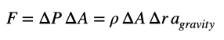
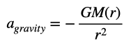
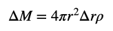
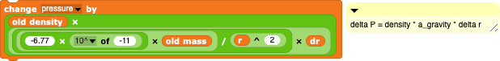

#  Example: Stellar/Planetary Structure

In this example, we'll see how to derive the inner density structure of a star or planet by solving the equation of hydrostatic equilibrium using a simple model for the connection between the density and pressure - the "equation of state".

## Introduction

Of course, stars and planets are seemingly infinitely complicated objects full of exotic physical processes under conditions of temperature and density that can only be partically studied in Earthly laboratories.  On the other hand, the basics are actually quite simple: these bodies have lots of mass that produces lots of gravity that wants to compress the material into smaller and smaller volumes but the pressure differences within the hot gas resists the pull of gravity, resulting in a (usually) stationary state where the two forces are balanced.  This stable state is called "hydrostatic equilibrium".  Without gravity, the pressure differences in the object would cause the object to fly apart (e.g. in Earthly weather, the wind blows from high pressure regions to low pressure regions) and without the force due to pressure differences, the object would collapse to a Black Hole.

The "Equation of Hydrostatic Equilibrium" shows exactly how the two forces are balanced and can be derived from Newton's second law: the force F is equal to the mass m times the acceleration a: F=m\*a.

Let  be the difference in pressure between the lower and upper sides of a parcel of gas in a star or planet (only a difference in pressure produces a net local force, since the same pressure on both sides would be fully balanced and there would be no effect).
Let  be the area perpendicular to the forces and the radial thickness (stars and planets are pretty spherical so all we need consider is the radial structure).
Let  be the mass-density (e.g. in kg/m^3) and mass of the parcel.
Newton's Second Law then says that

This equation is easily simplified to

(since the acceleration due to gravity is downwards, it is negative, so the pressure goes down with increasing height). This equation tells us that the force caused by a local radial gradient in pressure must be balanced by the gravitational force on material at the local density.

The gravitational acceleration is caused by all of the mass in the object at radii below the parcel (an amazing result found by Newton - the gravity of all the material at higher radii cancels out):

In order to make things simple, we can assume that there is a simple relation between our two gaseous properties, pressure and density, which one calls the "Equation of State".  In reality, this physics/chemistry is quite complicated, but there are some situations where a simple relation holds or can be used as an empirical approximation.  One of the simplest assumptions is that the pressure only depends upon some power of the density,

where the relation then only depends upon two constants.  There are astronomical objects that obey such a simple relationship, e.g. white dwarfs, the burned out cores of  Sun-like stars that have ended their active phase of energy production and cast off most of their mass.  Such cores are so dense that the pressure is due to the refusal of the electrons to be squeezed any farther, a quantum-mechanical effect called "degeneracy".  For moderate temperatures and densities (at least by white dwarf standards), the Equation of State is a reasonably simple function of physical constants and equal to

In order to derive the structure of the star or planet, we have to start at the bottom, where there is a core of very dense material, and work our way up. For every step upwards in radius, the Equation of Hydrostatic Equilibrium tells us how the pressure has to change and the Equation of State tells us what the density is at that pressure. By adding more material at a larger radius, we have changed the local gravity when we try to construct the next shell of material.

---

## Solving the equations

For our *Snap!* simulation, we first need to create some blocks for our basic physics and variables for our necessary physical quantities.
- Create a block that returns the pressure given a density: .
- Create a block that returns the density given a pressure (just invert the equation): .
- Create some variables for pressure, density, radius (here, called "r"), and radial step (here called "dr" for "delta-r").

The calculation needs some start values for the central density and the radial step.  The higher the density, the more mass your object will end up with.  The smaller the radial integration step, the finer your integration will be but the longer it will take.

After the two input variables have been set, we can initialized the rest, e.g.

where, here, the initial mass has been set to a small sphere of radius "dr" with the intial density.

For each integration step, we want to calculate things from the old values (e.g. the mass below the current radius), so it's good to store the old values before one starts changing to the new ones:

First, we calculate the new radius by incrementing it:

Next, we change the mass using a spherical shell of material with the area of a spherical shell, the thickness of the shell, and the old density

and the pressure:

Note that we're **decreasing** the pressure : if the new pressure is less than zero, we've reached the outer edge of our star/planet, so we might as well set the pressure to zero.

Finally, we save the new density, calculated from the new pressure.

All of this has to be put into a loop that starts and continues until the pressure is zero.  Since it's interesting to know just how many iterations it took to reach the surface, you probably want to keep track.

(here, all of the calculations for a single step listed above have been put into an "update" block).

---

## Test your simulation

If you have used a white dwarf equation of state, try to obtain a model for the white dwarf in the double-star system Sirius (the hot companion star is the brightest star in the northern sky) with a mass of 1.02 Solar Masses and a radius of 0.084 Solar Radii.  How close can you get?

Once your simulation works, try different radial steps: how does the result depend upon your choice?  How small does the step have to be relative to the final radius in order to attain 1% internal precision ("precision" means internal accuracy)?

---

## Plot your results

---

## Improving your simuation

- When a white dwarf has a large mass, the temperature within gets very large and the thermal motions of the electrons are nearly at the speed of light, which means that the degeneracy pressure has to be calculated differently using Einstein's Theory of Special Relativity.  This results in a different "relativistic" Equation of State

How does this change affect the masses and radii of your white dwarf simulations?  The density/pressure at which there is a transition from the non-relativistic to the relativistic state can be found by setting the two equations equal to each other.  Change your equation of state so that it is non-relativistic at low densities and relativistic at high densities.

- Write a simulation that calculates the radii of white dwarfs as a function of a range of masses and compare this with the observed "mass-radius relation" you can find in the internet.

- The Equation of State for very dense cold material (by stellar standards) can be also be approximated as a power-law. Such conditions are appropriate in the cores of massive planets like Jupiter and Saturn.  Try to find an Equation of State that will give you the right mass and radius for Jupiter.  Apply your model to Saturn, Uranus and Neptune - how well does it work?

- What power-law equation of State will produce a reasonable empirical model for the structure of the Sun (where the radius and mass come out fairly accurately)?

