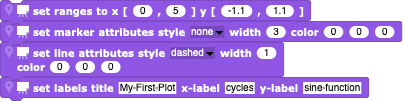

#  PlotSprite (v0.3)

One of the foundations of *Snap!*, like *Scratch*, is the *Logo*-like use of "turtle graphics" - simple pen-based drawing.  However, there is no generic means of displaying data graphically as a formal plot, something which is often needed when using *Snap!* for scientific or mathematical purposes.

The scientific-snap [PlotSprite](./PlotSprite.xml) displays data that is in the form of a table, often simple lists of (x,y) data pairs, and can also display histograms and functions of the x-axis.

The changes from v0.2 are:
- the plots are even nicer looking;
- the "add histogram.." block works correctly;
- two handy blocks were added that make it much simpler to create plots quickly by offering the use of a single organizing block:  and .

---

## Example

As an example, let's create a simple set of (x,y) data that we would like to have plotted. After defining a global "xydata" variable, pressing the following blocks

will create a corresponding list of (x,y) values (here, a simple sine function):

After importing PlotSprite.xml into our project, let us create an internal *PlotSprite* reaction to a global "plot data" broadcast message, 

Here, we have filled in all of the information necessary to make the plot: the source of the data (assumed to be a list of (x,y) value lists), the size, the labels, the appearances of the lines and markers, and their colours.  The result is

The alternative would be to create a block in the original *Sprite* that asks the *PlotSprite* to do the same: using a "tell ..."  block, specifying which *Sprite* is being asked (easy - just choose from a list), specifying the method of *PlotSprite* (here, "plot of..."), and listing the arguments of the blocks used (one can ask to have several blocks executed, so the list of arguments can be longer).

The disadvantage of the "tell ..." form is that the executing *Sprite* must be specified twice: if you use the "run ..." form, you only need specify this once.

---

## Plotting Histograms

*PlotSprite* will also produce histograms of values.  Since our "xydata" is a table, we need to extract just one column using the  block: if the second column argument is blank, only a single column will be returned.  The resulting *PlotSprite* script responding to a "plot histogram" broadcast

results in the following histogram:

(the histogram looks so terrible because we have so few samples!).

We can do the same from a different *Sprite*, again using inter-*Sprite* communication.  To make things easier to read, we first extract a copy of a single column (the sine-function values alone) and then ask the *PlotSprite* to plot the extracted data vector with the same arguments:

This form is obviously much more cumbersome because of the separation of the block and the arguments. For this reason, you will probably want to let your own version of *PlotSprite* do the plotting.  The disadvantage is that you will have to share the details of your use between different *Sprites*; you might want to remind yourself that you are thus changing the original *PlotSprite* by added foreign information - perhaps you should rename it to *SinePlotSprite*!

---

## Plotting by Hand

To see how plotting works, let's do all of the work by hand.  This way we can configure the plot to have many different properties and appearances, at the price of doing a lot more work.

First, we need a response header

then the creation of a new plot costume (the width, height, and colour of the frame used for plotting)

the initialization of the plot (definition of the plot boundaries and setting the line and marker properties)

and the actual plotting of the global data list

When we put these pieces together

and broadcast the message to *PlotSprite* (having already created the data)

we get get the same plot as before.

Note that we could not have created this block outside of the *PlotSprite*, since we used private blocks (the ones with the "location" and "poster" icons at the start of the block).

Of course, we could have created a normal "plot" block for *PlotSprite* instead of having it respond to a "plot data" broadcast message.

Here, the *PlotSprite* uses markers and no lines, whereas for the broadcast it uses no markers and a dashed line.  The other Sprites could then create a a different plot not by broadcasting a "plot data" message but by directly invoking the "plot" block, either by using the "run" block with a passed data argument

or by directly asking the *PlotSprite* to run it's "plot" block

The result is a slightly different plot:

Sometimes it's better to let *PlotSprite* figure out what the meaningful limits to the plot are, by looking at the data first:

which leaves some room around the edges:

When the numbers get very large or very small, the labels on the tics and axes are adjusted by scaling the displayed numbers:

Note that the original numbers were of order (x,y)=(0.000005,10000000).
Here, we have also added units to both axes - no scientific plot without units! - using the properties **xUnit** and **yUnit** :

This example is available here as [Example.xml](./Example.xml).

---

## Configuration parameters

Here is a table describing the various configuration parameters with which you can modify the appearance of your plots.

Name | Description | Default
---- | ----------- | -------
typeOfData | A keyword used to identify the type of data being plotted; currently not used. | "table"
backColor\* | RGB values used to determine the background colour of the plot; | 0,0,0
frontColor\* | RGB values used to determine the colour of the borders and label texts. | 0,0,0
plotBorder | If true, a border is plotted around the edge of the costume. | false
leftOffset | Space between the left edge of the costume and that of the plot. | (dynamic)
rightOffset | Space between the right edge of the costume and that of the plot. | (dynamic)
upperOffset | Space between the upper edge of the costume and that of the plot. | (dynamic)
lowerOffset | Space between the lower edge of the costume and that of the plot. | (dynamic)
title | Title text displayed above the plot. | (none)
titleHeight | Height of the title text. | 18
xLabel | Label text normally displayed below the plot. | (none)
xLabelHeight | Height of the xlabel text. | 16
yLabel | Label text normally displayed left of the plot. | (none)
yLabelHeight | Height of the ylabel text. | 16
xLeft | Left limiting scale value in units of the plot; can be > xRight. | -10
xRight | Right limiting scale value in units of the plot; can be < xLeft. | 10
yLower | Lower limiting scale value in units of the plot; can be > yUpper. | -10
yUpper | Upper limiting scale value in units of the plot; can be < yLower. | 10
xUnit | Units of the x-axis scale values (e.g. "km/s"); if given, displayed with the xLabel. | (none)
yUnit | Units of the y-axis scale values (e.g. "furlongs/fortnight"); if given, displayed with the yLabel. | (none)
lineStyle | Format of lines drawn between data-points; one of "none", "continuous", "dashed", "dash-dot", "dot-dot", or "rainbow". | "continuous"
lineWidth | Width of lines drawn between data-points. | 1
lineColor\* | RGB values for the colour used for lines drawn between data-points. | 0,0,0
datapointStyle | Format of markers representing data-points; one of "none", "o_circle", "._point", "+_plus", "x_ex", "square", or "triangle" | "square"
datapointWidth | Size of markers representing data-points. | 5
datapointConnected | (not used) | (not used)
datapointColor\* | RGB values for the colour of markers representing data-points. | 0,0,0
scalesXPrecision | Number of decimal places in the x-axis tic numbers. | (dynamic)
scalesYPrecision | Number of decimal places in the y-axis tic numbers. | (dynamic)
scalesXTextheight | Size of x-axis tic numbers. | 12
scalesYTextheight | Size of y-axis tic numbers. | 12
scalesXIntervals | Number of mini-tics between x-axis tic numbers. | (dynamic)
scalesYIntervals | Number of mini-tics between y-axis tic numbers. | (dynamic)
scalesXStart | Scaled starting number of x-axis tic numbers. | (dynamic)
scalesYStart | Scaled starting number of y-axis tic numbers. | (dynamic)
scalesXStep | Scaled difference between x-axis tic numbers. | (dynamic)
scalesYStep | Scaled difference between y-axis tic numbers. | (dynamic)
scalesXScaling | Factor between x-axis tic positions and scalesXStart,scalesXStep. | (dynamic)
scalesYScaling | Factor between y-axis tic positions and scalesYStart,scalesYStep. | (dynamic)
scalesTiclength | Length of axes tics | 6
scalesXMinitics | If true, minor tics are shown between the major x-axis tics. | true
scalesYMinitics | If true, minor tics are shown between the major y-axis tics. | true
scalesXGrid | If true, the major x-axis tics are connected. | false
scalesYGrid | If true, the major y-axis tics are connected. | false
scalesXCentered | If true, the y-axis is drawn along x=0. | false
scalesYCentered | If true, the x-axis is drawn along y=0. | false
