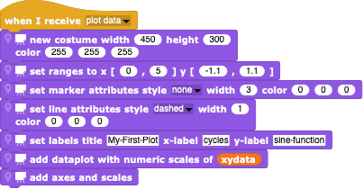
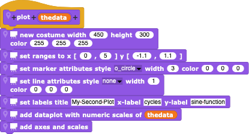

#  PlotSprite

One of the foundations of *Snap!*, like *Scratch*, is the *Logo*-like use of "turtle graphics" - simple pen-based drawing.  However, there is no generic means of displaying data graphically, something which is desperately needed when using *Snap!* for scientific or mathematical purposes.

The [PlotSprite.xml](./PlotSprite.xml) Sprite created by Eckart Modrow displays data in the form of simple lists of (x,y) data pairs and can also display functions of the x-axis.  The current model is to load *PlotSprite* into your project and create additional internal (**!**) *PlotSprite* methods for dealing with various plotting tasks.  Client Sprites can then invoke the global methods and *PlotSprite* can respond to global messages (e.g. the classic "green flag" start message).

---

### Example

As an example, let's create a simple set of data: when we define a global "xydata" variable and press the following blocks

we get a corresponding list of (x,y) values (here, a simple sine function):

After importing PlotSprite.xml into our project, let us create an internal *PlotSprite* reaction to a global "plot data" message, consisting of the response header

the creation of a new plot costume (the width, height, and colour of the frame used for plotting)

the initialization of the plot (definition of the plot boundaries and setting the line and marker properties)

and the actual plotting of the global data list

When we put these pieces together

and broadcast the message to *PlotSprite* (having already created the data)

we get

Note that we could not have created this block outside of the *PlotSprite*, since we used private blocks (the ones with the "location" and "poster" icons at the start of the block).

Of course, we could have created a "plot" block for *PlotSprite* instead of having it respond to a "plot data" broadcast message.

Note that here, the *PlotSprite* uses markers and no lines, whereas before it used no markers and a dashed line.  The other Sprites could then create a plot not by broadcasting a "plot data" message but by directly invoking the "plot" block with it's argument containing the data to be plotted, either by using the "run" block with a passed argument

or by directly asking the *PlotSprite* to run it's "plot" block with the data argument.

The result is a slightly different plot:

This example is available here as [Example.xml](./Example.xml).

