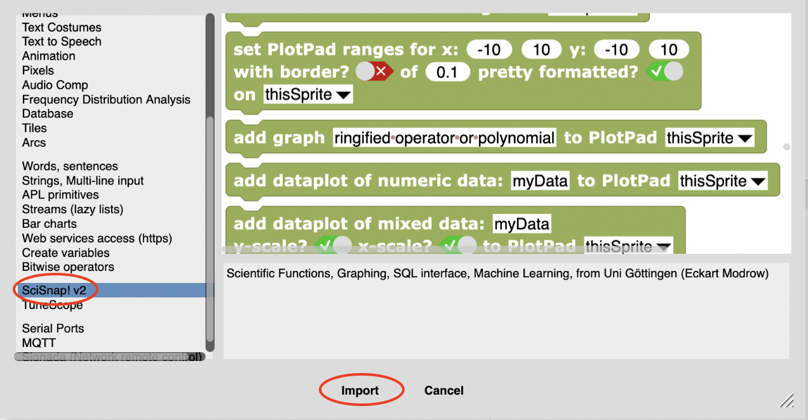

#  Scientific Snap!

## Motivation

Graphical programming languages like Scratch, GP, and Snap! have enabled school children and amateurs to explore the world of computer programming while having a lot of fun at the same time. Scratch, the father of Snap!, was designed to help children create fun computer graphics and games and so inherited the "turtle"-based graphics from the grandfather of graphic-capable educational languages, Logo. Snap! took Scratch's graphical interface but implemented a deeper and more powerful underlying computing infrastructure and made it possible to work fully within a browser window, relieving educators from the onerous task of installing software.

Although Snap! is now used at the Univ. of Berkeley to teach undergraduate introductory computer science, most users are caught in the Scratch-trap, thinking that it is only good for creating games, multi-media shows, and computer graphics.  The ease at which complex problems can be solved using a graphical language should be put to use for other educational purposes, e.g. enabling amateur programmers - especially in schools - to learn how scientific problems can be solved.  While the advanced amateur may want to learn how to program in other, more complex and undoubtably more powerful languages like C++ or python, your average middle-school or high school student doesn't have the time or inclination to climb that steep learning curve.

With Snap!, school classes can be enabled to produce their own scientific simulations or process sensor data using standard scientific techniques without the additional baggage of having to learn a complex computer language with a non-intuitive user interface. All Snap! needs, in addition to the standard set of computing tools, are a few more means of easily accessing, processing, and displaying data and additional tools that make Snap! scientific simulations simpler to programme and more powerful in their effect.

The purpose of this git project is to give a home for the collection of such resources as well as to collect examples of how such projects can be done.

E. Modrow and F.V. Hessman (2020-SEP-03)

---

## Installation

There is practically no installation! Use the standard Snap! link to start the Snap! environment.

If you want to plot your simulation results as a scientific plot, you can either use the old PlotSprite available here or - much better - you can simply use the built-in library called "SciSnap!".  Either way, you then need to turn on the "JavaScript Extensions" (sometimes vanilla Snap! simply isn't fast enough): 

You can load the "SciSnap!" libraries by looking for it in the official list of Snap! libraries:

and then scrolling down to near the bottom:

