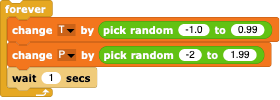

#  SciSnap! Example: Report from a Weatherstation

In this simple example, we'll see how to plot the reports from a weather station using SciSnap!'s Plotpad **Sprite**.
This project was developed for a German teacher's workshop, so some of the names and labels will be in German, which shouldn't be any problem for any non-German reader.

---

## Introduction

*SciSnap!* provides a large set of tools for creating and manipulating data in the form of tables and databases.
While normal *Snap!* has some support for reading and writing \*.csv file, *SciSnap!* lets the user manipulate the resulting tables beyond the list-of-lists model of the normal programming environment.
In particular, *SciSnap!* permits the use and manipulation of the table's *metadata* - the information _about_ _the_ _content_ of the table, rather than the content of the table itself.
In the simplest form, this metadata can be the labels for table headings, but it can also be as sophisticated as the header of a FITS file (the standard format for images and tables in astronomy).

Once data is created or read, one often wants to see the data displayed graphically.
The **PlotSprite** we have created for normal *Snap!* can be used for this purpose, but *SciSnap!* has imbedded **PlotSprite** into the set of "Pad" tools (like the "GraphPad" and "ImagePad"), which makes it even easier to create plots of data.

Here, we will create a simulation of the dynamic monitoring and display of weather data.
The data will be artificially created, but with a corresponding URL to a real weather station, the project could just as easily be used to collect and display real data.
Unfortunately, most online weather stations don't have a direct live public report via URL, but there are various ways to access real weather data online and nowadays any school can easily place their own weatherstation's data online, at least within the school's internal network.

## A simple weather report

As a simple start,  let's create a fake "current temperature" ("aktueller Temperatur") value as a reporting *Snap!* block:

We need a simple table for recording our values for plotting.
In *SciSnap!*, an empty table with two columns - running time and temperature ("Laufzeit" and "Temperature") - is easily created via

Note that the first number is the numer of columns (2) and the second number is the number of data rows (0, since we haven't collected any data yet).
Note also that we could have created an extra table for this purpose, but *SciSnap!* provides a standard place to put data, the **SciSnap!Data** variable.

*Snap!* provides a simple way to record the running time via the  and  blocks in the "Sensing" category: once the timer has been reset, every  call reports the amount of time in seconds that has past since the reset.
Every time we record the temperature, we only have to add a list containing the elapsed time and the "measured" temperature to **SciSnap!Data**.

In order to display this data, we need only add the *PlotPad* block that needs our data, the position and size of the plot on the *Snap!* **Stage**, optional axis labels and title, and the selection of markers, lines and their colours.

Note that each time the weather data is collected, a new plot is created dynamically.

## A more realistic weather station

While the previous example enabled us to create a dynamic report, the data were too simplistic: real weather stations provide much more detailed information and the running time is generally of little use.
It would be nice to eventually be able to display a whole range of weather data, not just the temperature.
Clearly, the reading and tabulation of the data should be independent of how the data are later displayed, so it would be much easier to have a **Sprite** resposible for the weather - a weatherstation simulator - and leave the displaying to other **Sprite**s.
This separation of "duties" to make a problem simpler is the basis for what is called "object-oriented programming": by separating the tasks into fairly independent units with well-defined interfaces (ways that the units interact with each other), the problem becomes simpler to programme.

Let's create a realistic weatherstation simulator that keeps tabs of the actual date and time the data were taken, and at least two weather measurements, say the temperature and pressure ("Temperatur" and "Druck").

To simulate realistic temperatures and pressures, we can start with some values and, with time, add random increments to them, simulating the slow change in the weather.
This means our simulator needs to have a memory of the previous values, so we create and initialize our temperature and pressure (local) variables:

Then, when the simulation starts (green flag broadcast), the weatherstation **Sprite** loops forever, changing the weather slightly every few seconds:

In order to plot how the weather has changed, we need a well-documented table with the date and times the measurements were made.  
For this, we use the  report block of *SciSnap!* : "datetime"'s are a way of compactly recording the total time information of a moment.
In the internationally normed ISO format, the year, month number and day are written YYYY-MM-DD, the hour, minute and second are written as hh:mm:ss.s as usual, and the two are separated by a "T".
Normally, the timezone information is added at the end.
The current weather report is then added via

The resulting temperature and pressure numbers are fine, but *Snap!* will give you the full decimal place resolution of the numbers: if you want to have good-looking tables, you can use *SciSnap!*'s formatting block  :

This is fine, as far as the weatherstation is concerned, but how can we display the time later on in a plot?
Unfortunately, *SciSnap!* doesn't yet support plotting time recorded in any format - only numbers, so we either have to add some plottable data to our table or the **Sprite**s that plot the data will have to convert the datetime strings into numbers before plotting.
The simplest solution is to add a column to our table that is plottable, e.g. the current number of total minutes in the time today as a "minutes" column ("Minuten" in German).
This kind of conversion can be done with *SciSnap!*'s  block - conversions to other times are possible, e.g. to Julian Date or decimal years.

Our weatherstation **Sprite** is now finished.  What is left is to have other **Sprite**s display the results.

## A Sprite to display the weather

Given that the weather data has been placed in a public table, **SciSnap!Data**, any **Sprite** that wants to display a subset of the current data simply has to loop forever, grabbing the current data now and then, and producing a plot of the results.
With *SciSnap!*'s **Plotpad**, this is _really_ easy: 
- Create a new **Sprite** for displaying, say, the temperature.
- When the green flag broadcast is made, have it loop forever.
- Within the loop, wait a while for the next weather report, then invoke a SIMPLE PLOT.

If you want to show the temperature and pressure simultaneously, simply create another **Sprite** and have it plot a different column.  By positioning the two **Sprite**s, you can then fill the **Stage** with dynamic weather information.

## Improve your weatherstation report

If your simulation runs for a long time, the table of data will get bigger and bigger.
In order to avoid running out of computer memory, you may want to limit the number of rows in your weatherstation's table.
While you could simply overwrite the table by starting all over again, the resulting plot would have a jump in it.
A better method is to delete the oldest entry before added the next one:

Note that the 1st data entry is actually in row \#2 (the labels are in row \#1).

Rather than putting in a plottable column in the weatherstation table, one can have the displaying sprites make the conversion.
This is easily done using *Snap!*'s map function: .
Map takes as input a list and iteratively does some operation on each sub-list, in our case each row of our table.

---

2021-05-03T09:12:30 FVH
