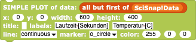

#  Example: Report from a Weatherstation

In this simple example, we'll see how to plot the reports from a weather station using SciSnap!'s Plotpad *Sprite*.
This project was developed for a German teacher's workshop, so some of the names and labels will be in German, which shouldn't be any problem for any non-German reader.

---

## Introduction

*SciSnap!* provides a large set of tools for creating and manipulating data in the form of tables and databases.
** Introduction

While normal *Snap!* has some support for reading and writing \*.csv file, *SciSnap!* lets the user manipulate the resulting tables beyond the list-of-lists model of the normal programming environment.
In particular, *SciSnap!* permits the use and manipulation of the table's *metadata* - the information _about_ _the_ _content_ of the table, rather than the content of the table itself.
In the simplest form, this metadata can be the labels for table headings, but can also be as sophisticated as the header of a FITS file.

Once data is created or read, one often wants to see the data displayed graphically.
The *PlotSprite* created for normal *Snap!* can be used for this purpose, but *SciSnap!* has imbedded *PlotSprite* into the set of "Pad" tools (like the "GraphPad" and "ImagePad"), which makes it even easier to create plots of data.

Here, we will create a simulation of the dynamic monitoring and display of weather data.
The data will be artificially created, but with a corresponding URL to a real weather station, the project could just as easily be used to collect and display real data.
Unfortunately, most online weather stations don't have a direct live public report via URL, but there are various ways to access real weather data online and nowadays any school can easily place their own weatherstation's data online, at least within the school's internal network.

## A simple weather report

As a simple start,  let's create a fake "current temperature" ("aktueller Temperatur") value as a reporting *Snap!* block:

We need a simple table for recording our values for plotting.
In *SciSnap!*, an empty table with two columns - running time and temperature ("Laufzeit" and "Temperature") - is easily created via

![new_table])(./images/new_table.png)

Note that the first number is the numer of columns (2) and the second number is the number of data rows (0, since we haven't collected any data yet).
Note also that we could have created an extra table for this purpose, but *SciSnap!* provides a standard place to put data, the *SciSnap!Data* variable.

*Snap!* provides a simple way to record the running time via the  and  blocks in the "Sensing" category: once the timer has been reset, every  call reports the amount of time in seconds that has past since the reset.
Every time we record the temperature, we only have to add a list containing the elapsed time and the "measured" temperature to *SciSnap!Data*.

In order to display this data, we need only add the *PlotPad* block

Note that each time the weather data is collected, a new plot is created dynamically.

** A more realistic weather report

While the previous example enabled us to create a dynamic report, the data were too simplistic: real weather stations provide much more detailed information and the running time is generally of little use.
Let's create a realistic weather report including the actual date and time the data were taken, and at least two weather measurements, say the temperature and pressure ("Temperatur" and "Druck").

Here, we use the  report block of *SciSnap!* : "datetime"'s are a way of compactly recording the total time information of a moment.
In the internationally normed ISO format, the year, month number and day are written YYYY-MM-DD, the hour, minute and second are written as hh:mm:ss.s as usual, and the two are separated by a "T".
Normally, the timezone information is added at the end.

Our data collector is easily modified to create a 3-column table and to add three weather values to the table, but how do we now display the time in a plot?
Unfortunately, *SciSnap!* doesn't yet support plotting time recorded in any format but some numbers, so we have to extract the data we want to plot from our table and calculated a new column of plottable numbers from that data.
In *Snap!*, this is easily done using the "map" function: a "map" is a recipe that is used over and over again on a list of data, one element of the list at a time.
In our case, we want to extract 2 values from each row of our table and convert one of the values from a ISO datetime string to a number.
The first task is simple: for each row of our table, we first extract the two rows of interest:

When this block is executed, you will note that the meta data (the labels at the tops of the columns are also included.
The labels themselves cannot be plotted, of course, and *SciSnap!* isn't yet intelligent enough to know that a data column with a label contains the metadata one would like to plot, so we need to remove the label before plotting.
This is easy using the normal *Snap!* function .

If the resulting two rows were plottable, we'd be finished, but we need to add the conversion from the ISO datetime to a number - e.g. using the  block

When this block is given as the source of plottable data, the time and temperature can be plotted exacly as reported by the (fake) weatherstation.

The conversion of a datetime to the fractional number of hours, minutes or seconds is for today only, but the number of minutes or seconds in a day can be large, so the values don't change much from measurement to measurement.
If you want to go back to the running time but this time using the table data, simply create a variable holding the beginning time (e.g. in minutes that day) and subtract that time within the "map" block.

## A more detailed report

Your weather station reports more than just the temperature, and *SciSnap!* lets you create more than one *PlotPad* *Sprite* : by creating several plots spaced and sized appropriately, you can display all of your weather data all at once.

---

2021-05-03T09:12:30 FVH
