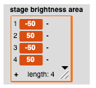

#  Stage Brightness

There are many examples of scientific phenomenon which cannot be seen directly, but only via the observation of some indirect measure.  For example, in astrophysics, most stellar phenomena are not directly visible simply because the stars are so far away - one can only observe the amount of light coming from them. *Snap!*'s graphical capabilities makes it simple to create simulations of what is going on but cannot be seen directly, so one merely needs to be able to "observe" what is happening in total on the *Stage* - one needs to convert the *Stage* into one giant pixel.  The result is the current average "brightness" or "colour" of the *Stage*, normalized to the brightness or colour of a typical 8-bit pixel, which has values between 0 and 255.

The [stage\_brightness.xml](./stage_brightness.xml) "sensing" blocks read some sub-image of the *Stage* and converts the pixel values into either a mean gray value

(a floating point number between 0.-255.) or the mean colour

(a list of the floating point RGB values between 0. and 255.).

Because this conversion is compute-intensive, it is good to limit the area which is used: the default is a 200x200 pixel area centered at the centre).  In order to change the boundaries of this area, there is a (global) sensing block called "set stage brightness area"

that stores this information in a global variable called **"stage brightness area"** consisting of a list with the values *(xmin,xmax,ymin,ymax)* in *Snap!* *Stage* units where the centre is at (0,0).

---

These blocks were developed for the EclipsingBinary and ExoplanetTransit simulation examples.

---

## Example

Here is an example of how to use the stage brightness blocks.  We first fill the *Stage* with a totally black background costume so that the reported *Stage* brightness will reflect whatever else we do.
* Select the *Stage* Sprite.
* Select the "Backgrounds" tab.
* Paint a new black costume by selecting the colour black and filling the area with this color.
* Rename the new costume "black" so one can reference it later.
Now we can paste something onto the *Stage* for to observe.
* Select or create a generic Sprite with the generic arrow costume and position the arrow at the centre of the Stage.
* Press the "paste on .." block to paste the generic arrow costume onto the *Stage*. 
* Set the **stage brightness area** to some reasonable value.
* Pull out a "gray value of stage" block from the "Sensing" block menu onto the workspace.
* Press the block so that it can report its value.
* Do the same with the "colour of stage" block.
