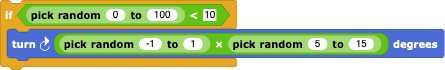

#  Example: Autonomous Driving

In this example, we'll see how to simulate a car capable of autonomously driving around moving obstacles.

---

## Introduction

---

## Sensing

Our very simply autonomous automobile has to ultimately react to four situations:
- it has to try to drive as fast as the speed limit and the traffic situation allows;
- it has to react to the driving of the automobile in front of it (e.g. braking when the other automobile is travelling more slowly);
- it has to stop at red traffic lights and start again when the light turns green; and
- it has to watch out for non-automotive traffic - a bicyclist randomly criss-crossing the street.

These functions would normally be done by
- knowing the local speed limit and accelerating whenever possible;
- sensing whether there is a nearby automobile ahead of itself;
- having a camera that looks for traffic lights and their states; and
- having a camera that looks for unexpected moving bodies that might enter the street in front of the automobile.

The equivalent *Snap!* programming techniques to emulate these sensors could be:
- have a global **speed limit** variable and have the automobile accelerate when it is traveling more slowly and can;
- using the  and  blocks to sense what other *AutoSprite*s are around;

---

## The road

The automobile should stay on the road.  This would be a good additional sensing task for the automobile, but since we're ignoring this one, all we need the road for is to give the automobile a clear path distinct from that of the bicylist.  The simplest possible road is a circle whose radius we can store in the variable  **radius**.  The position on the road is then simply the Cartesian angle relative to the circle's centre.

---

## The Simulation

The controlling *SimulationSprite* needs to set things up.  
- Define the global constants like **speed limit** and **radius**.
- Create the road (see above).
- Determine how many automobiles there are on the road and create clones of **AutomobileSprite**.

---

## The Automobile

As the automobile drives itself along the road

---

## Adding the traffic light

The traffic light itself is one of the simplest programming tasks. The *TrafficLightSprite* needs three costumes for the three states - red, green, and yellow - 
that are simply cycled through in a "forever" loop in this order with some rhythm (usually the yellow phases are much shorter). As soon as the red state timer is finished, switch the *costume* to the yellow light and start the next timer, etc.

Instead of a camera looking for traffic lights, we can use the distance between the automobile and the traffic light: if the distance is too large, the camera sees nothing and if the traffic light is getting bigger (i.e. the distance smaller) with time, the automobile is approaching it and should stop if the traffic light is red.

---

## Adding the Bicyclist

Just programming the *BicycleSprite* is also easy.  This *Sprite* should simply wander around the *Stage* randomly, stopping only when - heaven forbid! - it is hit by an automobile. After the "green flag" broadcast has been made, we give the bicyclist a decent *costume* and place it at some random point on the *Stage*.  Then, a "forever" loop should contain
- a test if the bicylist has collided with an auto 

- a random turn now and then 
 
(note how the random number generator gives us either a left, none, or right turn) and
- a slow motion ahead with the usual boucing off the *Stage* walls.

Similar to the approach used for traffic lights, our automobile can look to see if there are any bicylists within it's **horizon** and - if the bicyclist is too close - brake abruptly.  Once the bicylist is gone, the automobile resumes it's normal operations.

