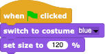
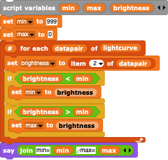
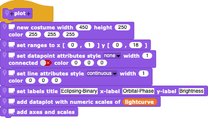

#  Example: Eclipsing Binary

Some simulations are needed in order to explain observations.  In this example, we'll see how to create a simulated "lightcurve" (brightness of an object versus time) of an eclipsing binary star system.  Such systems are very important in astrophysics, since they enable one to measure the masses of stars.  Although the [Exoplanet Transity Simulation](../ExolanetTransits) sounds different, the details of the simulation are nearly identical: replace one of the stars with a very lightweight exoplanet with practically no light of it's own, and you have the new simulation.

Since we are only interested in the lightcurve, only the properties of the stars that are relevant will be considered:
- a, the orbital separation of the two objects (in Snap! coordinates);
- P, the orbital period (in Snap! time);
- e, the orbital eccentricity (i.e. how ellipsoidal the orbit is): we will assume circular orbits for simplicity;
- q, the mass-ratio, usually defined as the secondary mass divided by the primary mass;
- the sizes of the stars relative to their separation; and
- the brightnesses per unit area of the stars, physically related to their temperatures, but in Snap! either their gray value(s) or RGB colour(s) of their costumes.

Then there are the observer-based properties:
- the orbital inclination (i=0 for a face-on orbit, 90 degrees for an edge-on orbit); for convenience, often uses the cosine of the inclination, cos(i), as the parameter - it is somewhere between 0 (orbit face-on) or 1 (orbit edge-on).

The two stars orbit around their common centre-of-mass, so that the actual radius of motion for the two stars are a fraction q/(1+q) and 1/(1+q) of their total separation for the primary and secondary stars, respectively.

The orbital phase is usually defined as being 0 when the secondary is directly in front of the primary and 0.5 (or 180 degrees) when the secondary is directly behind the primary.

For each time iteration, 
- determine the system time using a given time-step;
- calculate the orbital phase using the orbital period P;
- place the stars at their respective apparent positions;
- measure the brightness of the two, including the effects of mutual eclipses.

---

## Translation into Snap!

Snap! makes it easy to split the simulation into different sections and to develop (and debug!) them in simple stages.  For simplicity, we can split the simulation into three different major tasks:
- for every orbital phase, place the stars at the correct positions relative to their centres-of-mass, and make sure that the correct star is placed in front or back of the other one;
- measure the brightness of the simulation;
- plot the brightness as a function of orbital phase.

---

### Placing the stars on the Snap! *Stage*

First, we create two Sprites, the *PrimarySprite* and the *SecondarySprite* and give them an appropriate appearance, either by painting two circles with different sizes and colours, or by turning images from the internet into their costumes (removing the backgrounds via a transparent alpha channel). Make sure that the images are centred (there's a centring function in the paint tool).  The Sprites can then be scaled them to the desired sizes using an initial

For every time iteration, we need to calculate an orbital phase.  Since the trigonometric functions in Snap! take angles in degrees, we'll express the phase in degrees as well.  The running phase is simply then 360\*t/P, but we want a phase that stays within 0 to 360 degrees so we can always see what's going on: use the floor function to remove the non-decimal part of the phase

The x-position depends upon the individual separation from the centre-of-mass - which depends upon the total binary separation, mass-ratio, and which body is considerd - so it makes sense to create a generic block that places a Sprite at the right position for a given set of orbital parameters and then give it different values for the two different bodies.  Create a block for placing our stars at some relative separation s and an orbital offset o:

Within this block, the logical projected x-position for an orbit that is foreshortened only in the y-direction uses a cosine function that first gives the Cartesian position, but we'll add a geometrical phase offset that must be adjusted to give the right phase behaviour.

Note that for orbital phase=0 and offset=0, the x-position would be s\*separation, whereas it should be 0, so the offsets for our stars must be either 90 or 270 degrees (cos(90)=cos(270)=0).

The corresponding projected y-position is fore-shortened by a factor of cos(i):

Note that for phase=0 and offset=90, the y-position would be s\*separation\*cos(i), i.e. positive: this is the desired position of the secondary behind the primary; this fixes the functional phase offsets for both stars.  You may want to add an additional y-offset to the position to place the centre-of-mass at a more convenient position - we want to add a plot to the *Stage* later on.

Now, for each calculated time, we can compute a phase and, for that phase, move the corresponding Sprites to their positions as a function of their relative orbital radii and geometric phase offsets.  Between calculations, we can increment the time by some amount.  Place the calculation of phase, the positioning of the Sprites, and the time increment in an infinite loop, give the time a starting value of 0, and see what happens.

You will have noticed that it matters what order the Sprites are displayed: the primary should eclipse the secondary at phase 0 but be eclipsed by the secondary at phase 180 degrees.  Stick in an "if ... then ..." control block and duplicate  your positioning blocks, switching the order for the primary and secondary for 1/2 of the orbit.

---

### Measuring the brightness of the simulation

Once your simulation runs as expected, we want to calculate the apparent brightness as a function of orbital phase.  This can be easily done using the [stage brightness](../../StageBrightness)  blocks:
- Import the blocks; you'll see e.g. several new "Sensing" blocks. 
- Decide which part of the *Stage* needs to be measured (the smaller the area the better - Snap! isn't designed for heavy-duty number-crunching!) and set this region using 
- From the "Sensing" block menu, pull a  block to your workspace.
- Press the block and you should see a report of the gray value of the region you have chosen (if the simulation has already run and something has been pasted on the *Stage*); you should also see a new global variable called "stage brightness area" containing the (xmin,xmax,ymin,ymax) of the region as a check.

When your simulation runs, the phase changes very rapidly, so it's hard to see how the brightness changes during the eclipses.  A better approach is to store the values each time a brightness is calculated so that we can inspect the values (and, soon, plot them) later.
- Create a "lightcurve" variable and initialize it with an empty list.
- at the end of each iteration, add a list containing the phase and brightness to the lightcurve list .
- By asking the "lightcurve" list to display itself, you can inspect all the values in detail.

If all that we're interested in is the range of values (e.g. to determine the depth of the deepest eclipse), we can run the simulation, filling the "lightcurve", and then go through all of the values, looking for the minimum and the maximum brightnesses.

---

### Plotting the brightness as a function of orbital phase

Finally, we want a plotted lightcurve.  Import the [PlotSprite](../../PlotSprite) and give it a new **internal** (!) block called "plot"

This block uses the global lightcurve data list, gives the plot reasonable limits and labels, and creates a new plot costume for itself.  To invoke the plot, simply ask the *PlotSprite* to run it's plot block

If you put this block into the infinite loop, the plot will be dynamically created, a new data-point being added each time the *Stage* brightness is measured.

---

## Making your simulation more realistic

While this simulation is good, the lightcurves you produce will not be realistic.  That's because real stars are not uniformly bright discs: the edges of the stars are less bright, an effect called "limb-darkening".  This effect is due to the fact that stars are not solid objects but have atmospheres with layers that get thicker, genneraly hotter, and less transparent as one looks deeper and deeper in the star.  At the centre of the star, one can look fairly deeply before the star becomes opaque, but the line-of-sight near the limb encounters more material at higher levels and so becomes opaque where the atmosphere is generally cooler.  Cooler gas emits less light so the limb appears to be darker, giving the disc an artificial 3-D look.

(derived from https://en.wikipedia.org/wiki/Sun#/media/File:Sun_white.jpg; the background has been removed).  While one could attempt to paint such a disc, the simpler and physically **MUCH** better solution is to take the image of a **REAL** star - i.e. the Sun -- which shows the correct limb darkening behavior **by definition**.  This makes your simulation more realistic than some astronomy graduate students' attempts!

