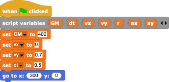

#  Example: Kepler Orbit

The simulation of an object in orbit around a large mass - the classic Keplerian 2-body  problem where the massive body is motionless - is easily done in scientific *Snap!*.  The only tricky part is understanding the few equations to be solved.

## Simple Theory

In a coordinate system with radius vector

the accelerations on the body are

where GM is the product of Newton's gravitational constant and the mass of the central body: this quantity determines how strong the gravitational forces are and hence how quickly things happen.

When the derivatives are replaced with simple differences - something any school child can understand who understands the concepts of speed and acceleration - one can express the x- and y-components as

where  is the time-step between each iteration.  Similarly, the velocity and position differences every iteration are

The value of GM and the initial velocities and positions are fixed before the simulation begins. For each calculated time, one calculates the current accelerations given the old positions, updates the velocities and positions, and repeats this for each timestep as long as the simulation is supposed to run.

## Translation into Snap!

First, we must identify the variables of interest, remembering that every Snap! Sprite already comes with variables for the x- and y-positions. Then, we can either define Snap! variables as global variables for all blocks and Sprites, or we can assume that the simulation will occur after it is started by a "green flag" broadcast.  Since the latter is more compact, we'll adopt the latter.

We'll use Snap! coordinates and assume the time is simply measured in terms of computer time, so the value of GM and the initial velcities will be chosen simply to make things work nicely.

Next, we replace the above equations with their Snap! equivalents.  The equation for the x-accelation is simply

and the x-velocity is easily modified using

and in the "Motion" block menu there's a block all ready to do the same to the x-coordinate.  Pack all of the translations into an infinite loop

In order to make the simulation "pretty", we should make the background colour of the Stage black (create a black costume with the drawing tools) and give our "planet" Sprite a planet-like costume (find a nice planet image on the internet, replace the background with a transparent alpha-channel and make it the costume of the Sprite).  One can, of course, add a "Sun" Sprite and place it at (0,0) so the "planet" has something to orbit around.

Finally, it is nice to see the shape of the orbit: before placing the planet Sprite at its initial position, raise the pen, set the pen colour, move the Sprite, and then lower the pen again: thereafter, the planet will leave a trail showing it's path.

Put everything together and the simultion should produce a fairly accurate elliptical (if the value of GM and velocities were chosen well) orbit where the planet Sprite moves around the centre or a hyperbolic orbit (GM and/or velocities chosen too large) where the planet Sprite quickly disappears.  More interesting is the question about the accuracy of the simulation: we haven't insured the conservation of energy or momentum, so if our integration is too crude (too big a time-step), then the orbit won't be Keplerian.

What can you do with the simulation, other than enjoy seeing the planet doing it's celestial rounds?
- Try to confirm Kepler's three "laws": (1) the closed orbits are ellipses; (2) the planet moves faster the closer it is to the central body (actually, the area traced out by the radius segment is equal in equal amounts of time); (3) the square of the period is proportional to the cube of the mean radius.  
- Try using the [PlotSprite](../../PlotSprite) to show the orbital properties graphically.
- Turning a differential equation into a simple difference equation is, well, simple enough but not particularly accurate.  There are other mathematical methods that can be used to improve the accuracy, notably the Runge-Kutta method (invented in Goettingen - yay! - and so pronounced "roonga-koota", not "runj-cut-a").
