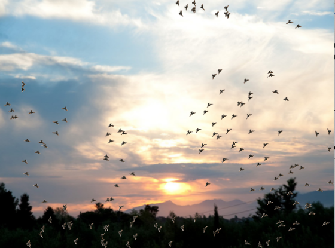

#  Example: Starling Swarm

In this example, we'll see how to simulate the swarming behaviour of birds.

---

## Introduction

The European Starling is a very common, small, black, as an individual otherwise not particularly notable bird.  However, they are very sociable, gathering in swarms of up to hundreds of thousands of individuals flying together.  When in such swarms, starlings perform amazing feats of collective aerobatics, producing highly dynamical patterns that give the impression of a common intelligence.  "Swarm intelligence" is the creation of collective behaviour out of the less untelligent behaviour of a large number of individuals.

Our *StarlingSprite*s only have to be able to react to a few situations in order to reproduce the behaviour of their namesakes.
- Starlings neither like to be near the ground (where there are enemies) nor at great heights (where there's no food), so each starling should want to fly upwards the closer the ground it is and fly downwards the higher it is. On the *Snap!* *Stage*, this is easily done by testing the *y position* and making it more likely to turn upwards or downwards, depending upon the height.
- Being sociable, they prefer to fly along with their neighbors. Each *StarlingSprite* can look at the other *Sprits*s in it's neighbourhood and decide to fly in the mean direction of all it's neighbours.
- They don't want to fly too close to their immediate neighbours for fear of colliding.  If a neighbour get's too close, our *StarlingSprite* should try to fly away from that neighbour.

---

## Add a hawk!

