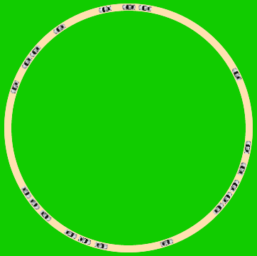

#  Example: Traffic Jam

In this example, we'll see how to simulate the creation of highway traffic jams.

---

## Introduction

Everybody who has driven on a highway in urban areas knows that dense traffic results in traffic jams that don't occur when the traffic is lighter.  Why is that?

The simplest way to find out is to simulate traffic where each automobile behaves like normal drivers do:
- they brake when there's someone in front of them 
- but otherwise try to go as fast as the speed limit allows them to.
With such a simulation, one can increase the density of traffic and see when the flow goes from smooth (all automobiles driving at roughly the same speed) to jammed (all cars are either braking when entering a jam or accelerating away from a jam).

---

## The road

To make the simulation as simple as possible, we don't want to worry about how the cars travel along the road - we just want to worry about their speed.  The simplest way to achieve this is to use a circular road where the automobiles are going 'round-and-'round in a circle of a given **radius**.

---

## The automobiles

The motion of each automobile is defined by the **position** and **speed**, where "position" means the Cartesian angle along the circle of the given **radius** (position=0 is to the right, =90 on the top)..

The costume should be chosen and scaled so that the automobiles fit to the road, the smaller the better to be able to get lots of automobiles into a traffic jam.

---

## The drivers

What each driver does is very simple to simulate: when the **SimulationSprite** tells all of the automobiles to  (i.e. decide how to move given the present position and speed and then do it), all of the automobiles
- change their **speed**  by braking, if there is someone in front of them, or speeding up if they are going slower than the speed limit;
- update their **position** using the new **speed**;
- convert the **position** into a Snap! coordinate and move to the new position.

### Changing the speed

In order to determine if there is an automobile in front of you, you need a means of determining which automobiles are close enough to matter.  You can either
- poll all of the automobiles and see which ones are a certain distance away using ; or
- use the concept of "neighbors" in  *Snap!*, a list of *Sprites* that is located within a distance twice the size of the *Sprite*'s costume.  If the size of the costume is small and the automobile is travelling fast, this is a bad way to determine if you should brake (in real traffic, one should keep about an automobile's length distance for every 10 km/h).  Thus, make sure your automobiles's costume has lots of transparent space around it (image formats like PNG let you declare than some pixels are transparent - the so-called "alpha" channel of the image).
In either case, one can define a **horizon** within which one deals with neighboring automobiles, however the "neightbors" are defined.

Given a list of neighbors, which ones are "in front"?  The simplest way is to compare the **position**s: if a neighbor has a **position** that is larger than one's own, then the automobile is "in front" in some sense.  Unfortunately, this won't work perfectly if **position** is actually an angle, since angles are cyclic : add or subtract 360 degrees from an angle and you get the same actual angle back again (e.g. -180 degrees is the same as +180 degrees).  For instance, if you have a **position** of 359 degrees and a neighbor has a position of 1 degree, then you are way ahead of the neighbor looking back (if the angles always increase), but right behind looking forward. This problem is simply solved by checking both the nominal **position** of the neighbor as well as **position**+360: if the difference between either of them is positive and less than the **horizon**, then you have someone in front of you and may need to brake.

How much does one need to brake?  Real drivers compare the *relative* speed - the difference between one's own speed and that of the other car - and estimate if the difference means thatthere is a danger of collision in the future.  This can be calculated by asking the other car for it's speed and comparing the difference.  The simpler way is to assume the distance between automobiles is roughly constant (nobody is braking or accelerating dramatically) and then to set the speed to a fraction of the distance to the nearest neighbor in front.

If there is no need to brake, then one can accelerate by adding a bit to the **speed** or simply adopting some random fraction of the **speed limit**.  In the former case, one needs to check if the speed gets to high and slow down if it is more than the **speed limit**.  It's always a good strategy to use some randomness when choosing the speed, since this is what real drivers do - even when there's an official **speed limit**, there will always be some driving a bit slower or faster than they could/should.

### Updating the position

Once the new **speed** has been determined, the new **position** is simply the old **position** plus the new **speed** (since the "speed" is given in "degrees of position per iteration").  Because of the cyclic properties of angles, one can subtract 360 whenever the **position** is larger than 360 degrees, so that all of the positions have the same rough value, but if nobody passes (an automobile can't get in front of the automobile in front or be passed by an automobile in back), then one can forget about this effect - the cosine and sine functions can handle angles larger than 360 degrees.

With the new **position**, one can update the *Snap!* position on the *Stage* and point the costume in the right direction:

## Starting the simulation

